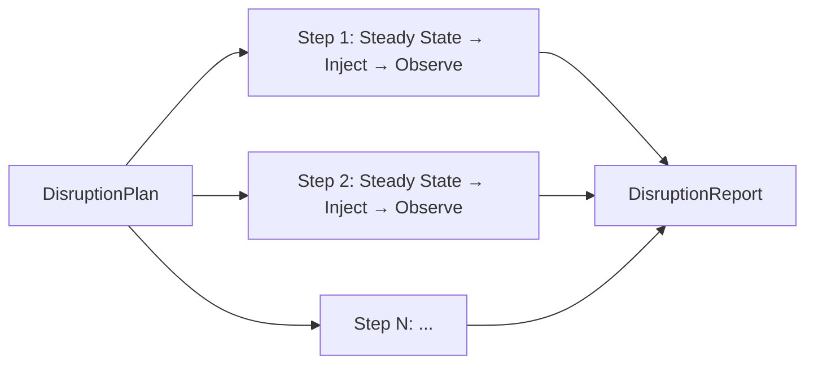
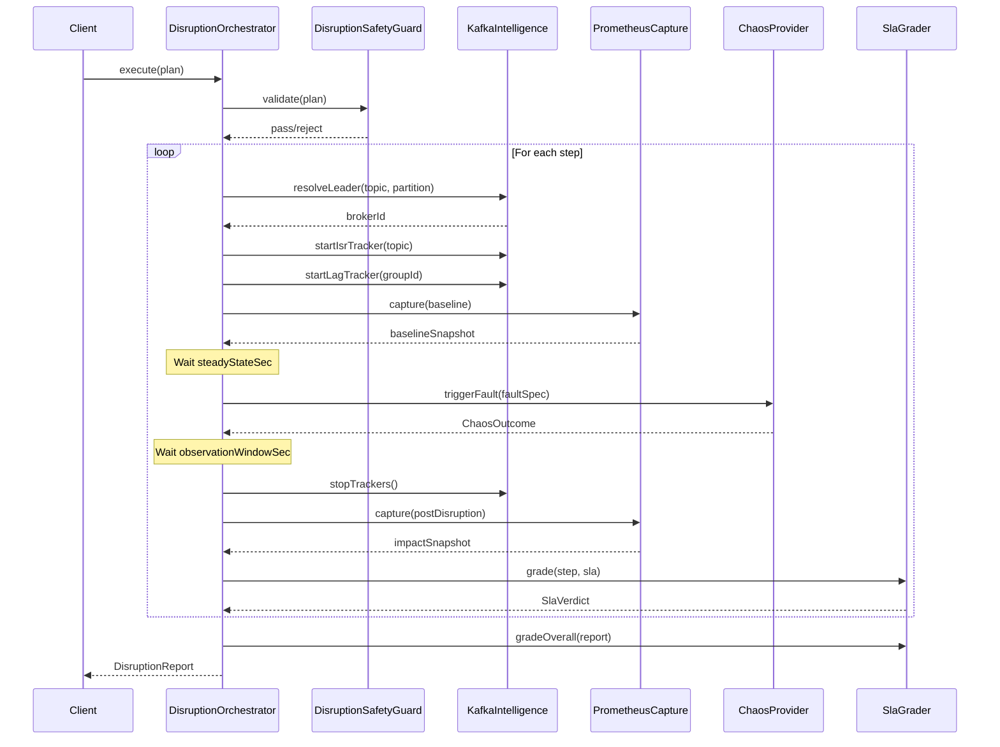
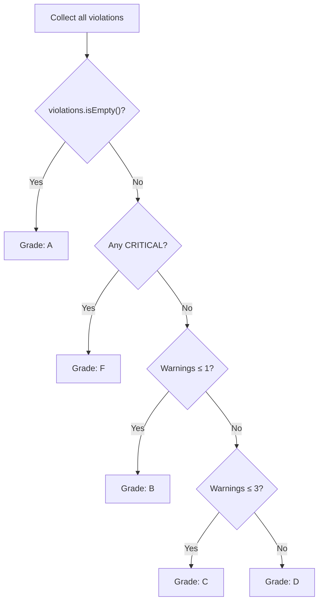
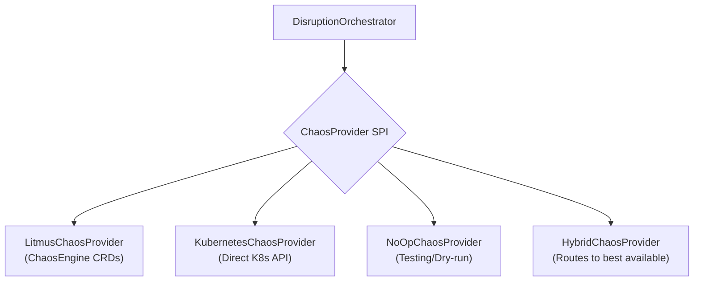

# Disruption & Chaos Engineering Guide

This document is a deep-dive into Kates' disruption testing subsystem — the engine that orchestrates chaos engineering experiments against your Kafka cluster. It covers every concept from fault specifications to safety guardrails, Kafka intelligence, SLA grading, and auto-rollback.

## What is Disruption Testing?

Disruption testing (also called chaos engineering) is the practice of deliberately injecting failures into a system to verify that it can tolerate and recover from real-world conditions. Instead of waiting for an outage to discover weaknesses, you proactively test failure scenarios in a controlled environment.

Kates' disruption subsystem is purpose-built for Kafka. It understands Kafka-specific concepts like partition leaders, ISR sets, consumer lag, and replication, and uses this intelligence to design targeted experiments and evaluate results.

## Disruption Types

Kates supports 10 backend-agnostic disruption types. Each type maps to a specific failure scenario that can be implemented by any `ChaosProvider` (Litmus, Kubernetes native, NoOp):

| Type | Description | Kafka Relevance |
|------|-------------|-----------------|
| `POD_KILL` | Immediately terminates a broker pod (SIGKILL) | Tests unclean leader failover, ISR shrink/expand |
| `POD_DELETE` | Deletes a broker pod (graceful shutdown via preStop hook) | Tests graceful leader transfer, controlled shutdown |
| `NETWORK_PARTITION` | Drops all traffic to/from a pod or set of pods | Tests split-brain scenarios, client reconnection |
| `NETWORK_LATENCY` | Injects delay on all network traffic (configurable ms) | Tests producer timeout handling, consumer session expiry |
| `CPU_STRESS` | Saturates CPU cores on a broker | Tests GC pressure, request queue buildup, latency degradation |
| `DISK_FILL` | Fills the broker's log directory to a target percentage | Tests log segment cleanup, broker refusing writes |
| `ROLLING_RESTART` | Triggers a graceful rolling restart of the StatefulSet | Validates zero-downtime restarts, ISR recovery time |
| `LEADER_ELECTION` | Forces a leader election for a specific partition | Tests preferred leader election, consumer rebalance |
| `SCALE_DOWN` | Reduces the replica count of a Deployment/StatefulSet | Tests under-replicated partition handling |
| `NODE_DRAIN` | Drains a Kubernetes node (cordons + evicts all pods) | Tests availability zone failure, multi-broker outage |

## FaultSpec Reference

Every fault injection uses a `FaultSpec` record that describes what to disrupt, where, and for how long. The `FaultSpec` is backend-agnostic — each `ChaosProvider` translates it to its native format (Litmus CRD, kubectl commands, etc.).

| Field | Type | Default | Description |
|-------|------|---------|-------------|
| `experimentName` | `String` | (required) | Unique name for the experiment (used for tracking) |
| `disruptionType` | `DisruptionType` | `null` | One of the 10 types listed above |
| `targetNamespace` | `String` | `"kafka"` | Kubernetes namespace where the target pods run |
| `targetLabel` | `String` | `"strimzi.io/component-type=kafka"` | Label selector to find target pods |
| `targetPod` | `String` | `""` | Specific pod name (overrides label selector) |
| `targetBrokerId` | `int` | `-1` | Kafka broker ID to target (used with `targetTopic` for leader resolution) |
| `targetTopic` | `String` | `""` | Topic whose partition leader should be targeted |
| `targetPartition` | `int` | `0` | Partition number for leader resolution |
| `chaosDurationSec` | `int` | `30` | How long the fault lasts |
| `delayBeforeSec` | `int` | `0` | Wait before injecting the fault |
| `gracePeriodSec` | `int` | `30` | Grace period for pod termination (0 = immediate SIGKILL) |
| `networkLatencyMs` | `int` | `100` | Network delay in ms (only for `NETWORK_LATENCY`) |
| `fillPercentage` | `int` | `80` | Disk fill target (only for `DISK_FILL`) |
| `cpuCores` | `int` | `1` | Number of CPU cores to stress (only for `CPU_STRESS`) |
| `envOverrides` | `Map<String,String>` | `{}` | Additional environment variables passed to the chaos engine |

### Leader-Aware Targeting

When you set `targetTopic` and `targetPartition`, Kates uses the `KafkaIntelligenceService` to resolve which broker is the current leader for that partition. This means you can say "kill the leader of partition 0" without knowing which broker that is — Kates figures it out at execution time.

```json
{
  "experimentName": "kill-leader-p0",
  "disruptionType": "POD_KILL",
  "targetTopic": "my-topic",
  "targetPartition": 0,
  "chaosDurationSec": 0,
  "gracePeriodSec": 0
}
```

The `KafkaIntelligenceService` calls `AdminClient.describeTopics()` to find the leader broker ID, then maps it to the corresponding Kubernetes pod name.

## Disruption Plans

A disruption plan is a multi-step sequence of fault injections, each with its own observation window and recovery requirements. Plans are the primary input to the `DisruptionOrchestrator`.



### Plan Fields

| Field | Type | Description |
|-------|------|-------------|
| `name` | `String` | Human-readable plan name |
| `description` | `String` | What the plan tests |
| `maxAffectedBrokers` | `int` | Safety limit — plan is rejected if it would affect more brokers |
| `autoRollback` | `boolean` | If `true`, faults are automatically reversed on timeout or failure |
| `isrTrackingTopic` | `String` | Topic to track ISR shrink/expand during the disruption |
| `lagTrackingGroupId` | `String` | Consumer group to monitor for lag during the disruption |
| `sla` | `SlaDefinition` | Pass/fail criteria for SLA grading |
| `steps` | `List<DisruptionStep>` | Ordered list of fault injection steps |

### Step Fields

Each step within a plan has these fields:

| Field | Type | Description |
|-------|------|-------------|
| `name` | `String` | Step name (used in reports) |
| `faultSpec` | `FaultSpec` | The fault to inject |
| `steadyStateSec` | `int` | Seconds to wait before injecting the fault (baseline collection) |
| `observationWindowSec` | `int` | Seconds to observe after fault injection (recovery monitoring) |
| `requireRecovery` | `boolean` | If `true`, the step fails unless the cluster recovers within the observation window |

## The 13-Step Execution Pipeline

When a `DisruptionPlan` is submitted via `POST /api/disruptions`, the `DisruptionOrchestrator` executes each step through this pipeline:



**Step-by-step breakdown:**

1. **Safety validation** — `DisruptionSafetyGuard.validate()` checks blast radius, RBAC permissions, and whether the cluster can survive the planned disruption
2. **Leader resolution** — `KafkaIntelligenceService` resolves which broker hosts the target partition leader
3. **ISR tracker start** — Background thread begins polling `AdminClient.describeTopics()` every 2 seconds to track ISR changes
4. **Lag tracker start** — Background thread begins polling `AdminClient.listConsumerGroupOffsets()` every 2 seconds to track consumer lag
5. **Baseline metrics capture** — `PrometheusMetricsCapture` queries Prometheus for 10 Kafka broker metrics
6. **Steady-state wait** — The orchestrator waits for the configured period to establish a performance baseline
7. **Fault injection** — `ChaosProvider.triggerFault()` injects the fault (creates Litmus CRD, deletes pod, etc.)
8. **Fault completion wait** — Waits for the `ChaosOutcome` future to complete (fault duration + timeout)
9. **Observation window** — The orchestrator waits for the configured observation period to monitor recovery
10. **Tracker stop** — ISR and lag trackers are stopped, and their collected data is attached to the step report
11. **Impact metrics capture** — Prometheus snapshot taken again for before/after comparison
12. **Step SLA grading** — `SlaGrader` evaluates the step results against the SLA definition
13. **Auto-rollback** (if needed) — If the step failed and `autoRollback` is enabled, the fault is reversed

## Kafka Intelligence

The `KafkaIntelligenceService` provides three forms of Kafka-specific intelligence that make disruption tests meaningful:

### Leader Resolution

Before injecting a fault that targets a specific partition leader, the intelligence service resolves the current leader broker ID:

```
Input:  topic="orders", partition=3
Output: brokerId=2 → pod="krafter-kafka-2"
```

This means you can write disruption plans that say "kill the leader of the orders topic, partition 3" without knowing which broker holds the leadership at execution time. This is essential because leadership can change between test runs.

### ISR Tracking

During a disruption, the ISR (In-Sync Replica) set for the tracked topic is polled every 2 seconds. The tracker records:

- **ISR shrink events** — when a replica falls out of the ISR set (indicating the fault has taken effect)
- **ISR expand events** — when a replica rejoins the ISR set (indicating recovery)
- **Time-to-Full-ISR** — the duration from fault injection to all replicas being back in sync

A healthy cluster should show ISR shrink shortly after fault injection, followed by ISR expand within a reasonable window. If ISR never recovers, the cluster may have a replication issue.

### Consumer Lag Monitoring

For consumer-side disruption tests, the lag tracker monitors the total uncommitted offset lag for a consumer group. It records:

- **Peak lag** — the maximum observed lag during the disruption
- **Time-to-Lag-Recovery** — how long until lag returns to the pre-disruption baseline
- **Lag trend** — whether lag is increasing, stable, or decreasing over time

## Safety Guardrails

The `DisruptionSafetyGuard` provides multiple layers of protection to prevent accidental damage to production-like environments:

### Blast Radius Validation

Before any fault is injected, the safety guard calculates how many brokers would be affected and rejects plans that exceed the `maxAffectedBrokers` limit:

```
Plan: maxAffectedBrokers=1
Step: targetLabel="strimzi.io/component-type=kafka" (matches 3 pods)
Result: REJECTED — "Would affect 3 brokers, limit is 1"
```

### RBAC Permission Check

The safety guard calls the Kubernetes `SelfSubjectAccessReview` API to verify that the Kates service account has the permissions needed for the planned disruption:

- `POD_KILL` / `POD_DELETE` → needs `pods/delete`
- `SCALE_DOWN` → needs `statefulsets/scale/patch`
- `NETWORK_PARTITION` → needs `chaosengines/create` (Litmus)

If any required permission is missing, the plan is rejected with a clear error message explaining which permission is needed and why.

### Dry-Run Mode

Calling `POST /api/disruptions?dryRun=true` executes the full validation pipeline without actually injecting any faults. The response shows:

- Which pods would be affected
- Which broker is the current leader (resolved via AdminClient)
- Whether RBAC permissions are sufficient
- Any warnings (e.g., "ISR tracking topic does not exist")
- Any errors that would cause the plan to fail

### Auto-Rollback

When `autoRollback=true` (the default), faults are automatically reversed if:

- The step exceeds its observation window without recovery
- The chaos provider returns a `FAILED` status
- An unexpected exception occurs during execution

For `POD_KILL` and `POD_DELETE`, rollback is a no-op because Kubernetes automatically restarts the pod. For `NETWORK_PARTITION` and `CPU_STRESS`, rollback actively removes the injected fault (deletes the Litmus ChaosEngine CRD or sends cleanup commands).

## SLA Grading

The `SlaGrader` evaluates disruption test results against a `SlaDefinition` and produces a letter grade. This provides a clear, actionable pass/fail signal for your resilience test.

### SLA Definition Fields

| Metric | Field | Unit | Description |
|--------|-------|------|-------------|
| Max P99 latency | `maxP99LatencyMs` | ms | Highest acceptable P99 latency during disruption |
| Max P95 latency | `maxP95LatencyMs` | ms | Highest acceptable P95 latency during disruption |
| Max average latency | `maxAvgLatencyMs` | ms | Highest acceptable average latency |
| Max max latency | `maxMaxLatencyMs` | ms | Highest acceptable worst-case latency |
| Min throughput | `minThroughputRecPerSec` | rec/s | Lowest acceptable throughput |
| Max error rate | `maxErrorPercent` | % | Highest acceptable error rate |
| Max RTO | `maxRtoMs` | ms | Recovery Time Objective — maximum time to recover |
| Max RPO (data loss) | `maxDataLossPercent` | % | Recovery Point Objective — maximum acceptable data loss |
| Max lag | `maxConsumerLagRecords` | records | Maximum acceptable consumer lag |

### Grading Algorithm

The grader checks each metric in the SLA definition against the actual value from the disruption step results. Each violation impacts the grade:



**Violation severity levels:**

| Level | Condition | Example |
|-------|-----------|---------|
| `CRITICAL` | Actual value > 5× the threshold | P99 latency: threshold=100ms, actual=600ms |
| `MAJOR` | Actual value > 2× the threshold | Throughput: threshold=10000, actual=4000 |
| `WARNING` | Threshold exceeded but within 2× | Error rate: threshold=1%, actual=1.5% |

### Worked Example

Given this SLA definition:

```json
{
  "maxP99LatencyMs": 100.0,
  "minThroughputRecPerSec": 10000.0,
  "maxErrorPercent": 1.0
}
```

**Scenario A — Grade: A**
- P99 latency: 45ms (within threshold ✓)
- Throughput: 15,000 rec/s (within threshold ✓)
- Error rate: 0.2% (within threshold ✓)

**Scenario B — Grade: B**
- P99 latency: 120ms (WARNING: 1.2× threshold)
- Throughput: 12,000 rec/s (within threshold ✓)
- Error rate: 0.5% (within threshold ✓)

**Scenario C — Grade: F**
- P99 latency: 800ms (CRITICAL: 8× threshold)
- Throughput: 2,000 rec/s (CRITICAL: below 5× threshold)
- Error rate: 12% (CRITICAL: 12× threshold)

## Chaos Providers

Kates uses a pluggable `ChaosProvider` SPI to support multiple chaos engineering backends. Each provider translates the backend-agnostic `FaultSpec` into its native implementation.



### LitmusChaosProvider

Uses LitmusChaos CRDs to inject faults. Creates `ChaosEngine` resources that reference pre-installed `ChaosExperiment` resources. Supports all 10 disruption types through Litmus' experiment catalog.

**Advantages:** Battle-tested, rich experiment library, Kubernetes-native, supports complex network faults.

### KubernetesChaosProvider

Uses the Kubernetes API directly (via the Kubernetes Java client). Supports a subset of disruption types: `POD_KILL` (delete pod), `POD_DELETE` (delete with grace period), `SCALE_DOWN` (patch replica count), `ROLLING_RESTART` (annotate pod template).

**Advantages:** No additional CRDs required, works on any Kubernetes cluster, simpler setup.

### NoOpChaosProvider

Returns synthetic `ChaosOutcome` objects without injecting any faults. Used for testing the orchestration pipeline and for dry-run mode.

### HybridChaosProvider

The default provider. Routes each `FaultSpec` to the best available provider: uses `LitmusChaosProvider` for complex faults (network, CPU, disk) if Litmus is installed, falls back to `KubernetesChaosProvider` for simple faults (pod kill, scale down).

## Writing Custom Disruption Plans

Here is a complete example of a custom disruption plan that tests consumer resilience during a rolling restart:

```json
{
  "name": "consumer-resilience-during-restart",
  "description": "Verify consumers handle a rolling restart without data loss",
  "maxAffectedBrokers": 1,
  "autoRollback": false,
  "isrTrackingTopic": "orders",
  "lagTrackingGroupId": "order-processor",
  "sla": {
    "maxP99LatencyMs": 500.0,
    "minThroughputRecPerSec": 5000.0,
    "maxErrorPercent": 0.0,
    "maxDataLossPercent": 0.0,
    "maxConsumerLagRecords": 50000
  },
  "steps": [
    {
      "name": "rolling-restart-kafka",
      "steadyStateSec": 60,
      "observationWindowSec": 300,
      "requireRecovery": true,
      "faultSpec": {
        "experimentName": "consumer-restart-test",
        "disruptionType": "ROLLING_RESTART",
        "targetLabel": "strimzi.io/component-type=kafka",
        "chaosDurationSec": 300,
        "gracePeriodSec": 30
      }
    },
    {
      "name": "verify-lag-recovery",
      "steadyStateSec": 30,
      "observationWindowSec": 120,
      "requireRecovery": true,
      "faultSpec": {
        "experimentName": "lag-recovery-check",
        "disruptionType": "LEADER_ELECTION",
        "targetTopic": "orders",
        "targetPartition": 0,
        "chaosDurationSec": 0
      }
    }
  ]
}
```
