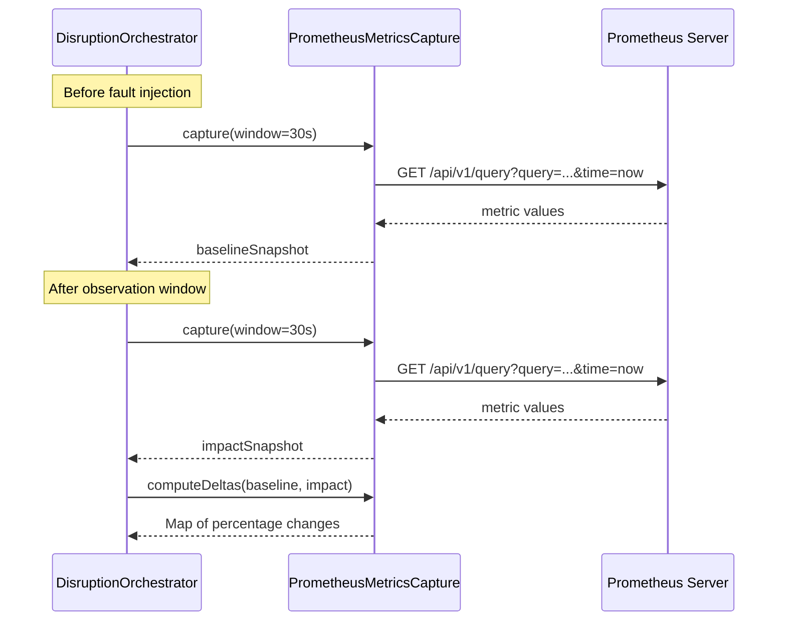

# Observability

This document describes the observability capabilities built into Kates — how it instruments disruption tests with Prometheus metrics, captures before/after snapshots, and integrates with external monitoring systems.

## Prometheus Metrics Capture

The `PrometheusMetricsCapture` service connects to a Prometheus server during disruption tests to collect Kafka broker metrics. It captures two snapshots per disruption step — one before the fault (baseline) and one after — to compute the real performance impact of the disruption.

### Configuration

```properties
kates.prometheus.url=http://prometheus.monitoring.svc:9090
```

Kates connects to Prometheus using the standard HTTP API (`/api/v1/query`). The URL defaults to the typical in-cluster Prometheus service address.

### Captured Metrics

The service queries 10 Kafka broker metrics using PromQL. Each metric is queried as an instant query at a specific timestamp:

| Metric Key | PromQL Query | Unit | Description |
|-----------|-------------|------|-------------|
| `throughputRecPerSec` | `sum(rate(kafka_server_brokertopicmetrics_messagesin_total[1m]))` | rec/s | Aggregate message-in rate across all brokers |
| `avgLatencyMs` | `avg(kafka_network_requestmetrics_totaltimems{request="Produce"}) / 1000` | ms | Average produce request latency |
| `p99LatencyMs` | `histogram_quantile(0.99, sum(rate(..._bucket[1m])) by (le)) / 1000` | ms | P99 produce request latency from histogram |
| `underReplicatedPartitions` | `sum(kafka_server_replicamanager_underreplicatedpartitions)` | count | Number of partitions with fewer replicas than expected |
| `activeControllerCount` | `sum(kafka_controller_kafkacontroller_activecontrollercount)` | count | Should be exactly 1 in a healthy cluster |
| `bytesInPerSec` | `sum(rate(kafka_server_brokertopicmetrics_bytesin_total[1m]))` | bytes/s | Total bytes received across all brokers |
| `bytesOutPerSec` | `sum(rate(kafka_server_brokertopicmetrics_bytesout_total[1m]))` | bytes/s | Total bytes sent across all brokers |
| `produceRequestsPerSec` | `sum(rate(kafka_server_brokertopicmetrics_totalproducerequests_total[1m]))` | req/s | Produce request rate |
| `fetchRequestsPerSec` | `sum(rate(kafka_server_brokertopicmetrics_totalfetchrequests_total[1m]))` | req/s | Fetch request rate |
| `isrShrinkPerSec` | `sum(rate(kafka_server_replicamanager_isrshrinks_total[1m]))` | events/s | Rate of ISR shrink events (replicas falling behind) |

### Snapshot Lifecycle



### Impact Delta Computation

The `computeDeltas()` method calculates the percentage change between baseline and impact snapshots for each metric:

```
delta = ((impactValue - baselineValue) / baselineValue) × 100%
```

A delta of `-50%` for `throughputRecPerSec` means throughput dropped by half during the disruption. A delta of `+200%` for `underReplicatedPartitions` means under-replicated partitions tripled.

### Availability Check

Before using Prometheus metrics, the disruption orchestrator calls `PrometheusMetricsCapture.isAvailable()`, which sends a GET request to `/-/healthy`. If Prometheus is not reachable, the disruption test continues without Prometheus snapshots — the test results still include Kafka intelligence data (ISR, lag) and SLA grading, but the Prometheus-specific impact deltas will be absent.

## Kafka-Native Observability

Independent of Prometheus, Kates provides Kafka-native observability through the `KafkaIntelligenceService`:

### ISR Tracking

A background thread polls `AdminClient.describeTopics()` every 2 seconds and records the ISR set for the tracked topic. The data collected includes:

- **ISR set timeline** — the complete list of ISR members at each poll interval
- **Shrink events** — when a replica drops out of the ISR
- **Expand events** — when a replica rejoins the ISR
- **Time-to-Full-ISR** — duration from first shrink to all replicas back in sync

### Consumer Lag Tracking

A background thread polls `AdminClient.listConsumerGroupOffsets()` every 2 seconds and records the total lag for the tracked consumer group:

- **Lag timeline** — total uncommitted offset count at each poll interval
- **Peak lag** — maximum observed lag during the observation window
- **Time-to-Lag-Recovery** — duration from peak lag to pre-disruption baseline

### Pod Event Stream

The `K8sPodWatcher` uses the Kubernetes watch API to stream pod lifecycle events in real-time during disruptions:

- Pod termination events (with reason and exit code)
- Pod restart events (with restart count)
- Pod readiness state changes

These events are correlated with the disruption timeline to provide a complete picture of what happened at the Kubernetes level during the chaos experiment.

### Strimzi State Tracking

The `StrimziStateTracker` watches the Strimzi Kafka custom resource for status changes during disruptions. It records:

- **Ready condition changes** — transitions between `Ready=True` and `Ready=False`
- **Listener changes** — when bootstrap addresses change
- **Operator reconciliation events** — when Strimzi's operator reconciles the cluster

## Health Endpoint Diagnostics

The `GET /api/health` endpoint provides real-time observability into Kates' configuration and connectivity:

```json
{
  "status": "UP",
  "engine": {
    "activeBackend": "native",
    "availableBackends": ["native", "trogdor"]
  },
  "kafka": {
    "status": "UP",
    "bootstrapServers": "krafter-kafka-bootstrap.kafka.svc:9092"
  },
  "tests": { "..." }
}
```

Use the health endpoint to verify:

- Kafka cluster connectivity after deployment
- Backend availability (is Trogdor running?)
- Effective test configuration (did the ConfigMap changes take effect?)
- Configuration resolution (which tier provided each value?)

## Disruption Event Stream (SSE)

The `DisruptionStreamResource` provides a Server-Sent Events endpoint at `GET /api/disruptions/stream` for real-time monitoring of disruption progress:

```
event: step-started
data: {"step":"kill-leader","status":"INJECTING","timestamp":"2026-02-18T03:00:00Z"}

event: fault-injected
data: {"step":"kill-leader","faultType":"POD_KILL","target":"krafter-kafka-1"}

event: isr-update
data: {"topic":"orders","partition":0,"isr":[0,2],"shrunk":true}

event: step-completed
data: {"step":"kill-leader","status":"COMPLETED","recoveryMs":12500,"grade":"A"}

event: report-ready
data: {"reportId":"abc123","overallGrade":"A","steps":1}
```

This endpoint is designed for real-time dashboards that want to show live disruption progress with step-by-step updates.
