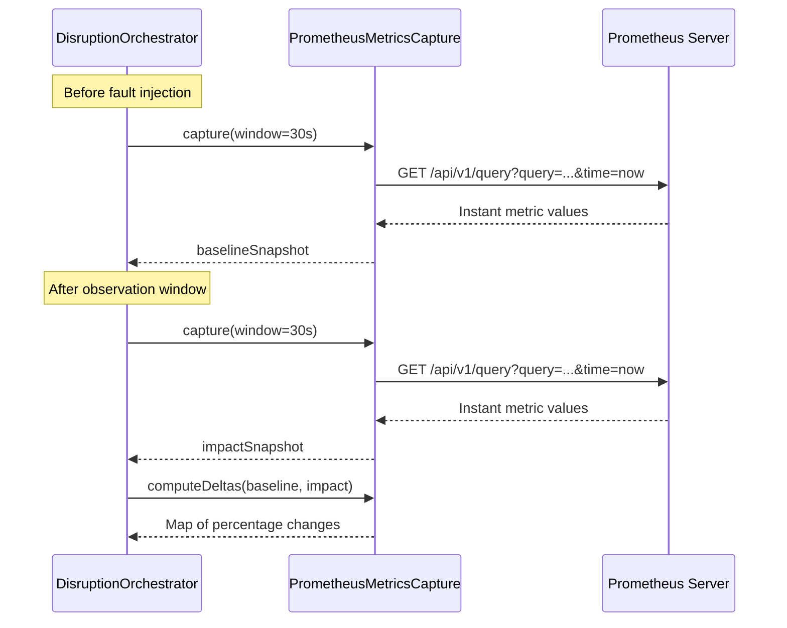

# Observability

You cannot improve what you cannot measure, and you cannot debug what you cannot see. Observability is the practice of instrumenting your system so that its internal state can be understood from the outside — through metrics, logs, traces, and events. In the context of Kafka chaos engineering, observability is what transforms "we killed a broker and then waited" into "we killed a broker, watched the ISR shrink from 3 to 2 in 12 seconds, observed throughput drop 15%, saw the ISR recover in 45 seconds, and confirmed that P99 latency returned to baseline within 60 seconds."

Kates provides observability at three levels: Prometheus metrics capture for infrastructure-level visibility, Kafka-native intelligence for application-level visibility, and a real-time event stream for live monitoring during experiments. This chapter explains what each level captures, how the data flows, and how to use it.

## Prometheus Metrics Capture: Infrastructure-Level Visibility

Prometheus is the de facto standard for infrastructure monitoring in Kubernetes environments. If you are running Kafka on Kubernetes with Strimzi, you almost certainly have Prometheus collecting broker metrics through JMX exporters. Kates leverages this existing infrastructure by querying Prometheus directly during disruption tests to capture before-and-after snapshots.

### Why Prometheus is Relevant

Kafka brokers expose hundreds of JMX metrics, but only about a dozen are meaningful for understanding disruption impact. The `PrometheusMetricsCapture` service queries exactly the right metrics to answer the question: "What happened to the cluster's health during this disruption?"

Each metric is queried as a PromQL instant query against the Prometheus HTTP API (`/api/v1/query`). The queries are pre-defined because ad-hoc metric selection during a chaos experiment would require deep Prometheus expertise that most users do not have. Kates encodes that expertise into its metric selection.

### The 10 Captured Metrics

| Metric Key | PromQL Query | What It Reveals |
|-----------|-------------|-----------------|
| `throughputRecPerSec` | `sum(rate(kafka_server_brokertopicmetrics_messagesin_total[1m]))` | Total message ingestion rate across all brokers. A drop indicates the cluster is processing fewer messages — either producers are sending less or brokers are refusing writes. |
| `avgLatencyMs` | `avg(kafka_network_requestmetrics_totaltimems{request="Produce"}) / 1000` | Average time to process a Produce request end-to-end. Includes network, queue, and disk I/O time. |
| `p99LatencyMs` | `histogram_quantile(0.99, sum(rate(..._bucket[1m])) by (le)) / 1000` | 99th percentile produce latency from Prometheus histograms. This is the tail latency — the experience of your slowest 1% of requests. |
| `underReplicatedPartitions` | `sum(kafka_server_replicamanager_underreplicatedpartitions)` | Number of partitions where the ISR is smaller than the replication factor. Should be 0 in a healthy cluster. A spike here is the first sign of replication trouble. |
| `activeControllerCount` | `sum(kafka_controller_kafkacontroller_activecontrollercount)` | Should be exactly 1. A value of 0 means no controller is active (cluster is in a degraded state). A value of 2 means split-brain. |
| `bytesInPerSec` | `sum(rate(kafka_server_brokertopicmetrics_bytesin_total[1m]))` | Total bytes received across all brokers. Useful for understanding throughput in terms of data volume rather than message count. |
| `bytesOutPerSec` | `sum(rate(kafka_server_brokertopicmetrics_bytesout_total[1m]))` | Total bytes sent across all brokers. Includes both consumer fetches and inter-broker replication. |
| `produceRequestsPerSec` | `sum(rate(kafka_server_brokertopicmetrics_totalproducerequests_total[1m]))` | Producer request rate. A drop indicates producers are backing off or unable to connect. |
| `fetchRequestsPerSec` | `sum(rate(kafka_server_brokertopicmetrics_totalfetchrequests_total[1m]))` | Fetch request rate from both consumers and follower replicas. A drop may indicate consumer disconnection or replication stalling. |
| `isrShrinkPerSec` | `sum(rate(kafka_server_replicamanager_isrshrinks_total[1m]))` | Rate of ISR shrink events. In a healthy cluster, this is 0. During a disruption, this spikes as broker failure causes replicas to fall behind. |

### The Snapshot Lifecycle

The `PrometheusMetricsCapture` service captures two snapshots per disruption step — one before the fault and one after — to compute the impact:



The `computeDeltas()` method calculates the percentage change for each metric:

```
delta = ((impactValue - baselineValue) / baselineValue) × 100%
```

A delta of `-50%` for `throughputRecPerSec` means throughput dropped by half. A delta of `+300%` for `underReplicatedPartitions` means under-replicated partitions quadrupled. These deltas are included in the disruption report alongside the ISR and lag tracking data, giving you a complete picture of the disruption's impact at both the infrastructure and application levels.

### Graceful Degradation Without Prometheus

Prometheus is valuable but not required. Before using Prometheus metrics, the disruption orchestrator calls `PrometheusMetricsCapture.isAvailable()`, which sends a GET request to `/-/healthy`. If Prometheus is unreachable — perhaps it has not been deployed, or it is in a different namespace, or it is temporarily down — the disruption test continues without Prometheus snapshots.

This is a deliberate design decision: Prometheus enhances observability, but its absence should never prevent you from running a disruption test. The test results will still include Kafka intelligence data (ISR tracking, lag monitoring) and SLA grading — just without the Prometheus-specific infrastructure metrics.

To configure the Prometheus URL:

```properties
kates.prometheus.url=http://prometheus.monitoring.svc:9090
```

## Kafka-Native Observability: Application-Level Visibility

While Prometheus provides infrastructure-level metrics (throughput, latency, under-replicated partitions), it does not capture the fine-grained, time-series data that Kates needs for disruption analysis. For this, Kates provides its own Kafka-native observability through the `KafkaIntelligenceService`, which uses the Kafka AdminClient directly.

### ISR Tracking: The Replication Health Timeline

The ISR (In-Sync Replica) set is Kafka's most important internal health indicator. When a broker fails, the ISR shrinks. When it recovers, the ISR expands. The timeline of ISR changes during a disruption tells you exactly how the cluster's replication layer responded to the failure.

During a disruption, a background thread polls `AdminClient.describeTopics()` every 2 seconds and records the ISR membership for the tracked topic. This produces a dense timeline:

```
t=0s    ISR: [0, 1, 2]   ← baseline
t=10s   ISR: [0, 1, 2]   ← still healthy
t=12s   ISR: [0, 2]      ← broker 1 fell out (killed at t=2s, lag timeout at t=12s)
t=14s   ISR: [0, 2]      ← still recovering
...
t=44s   ISR: [0, 1, 2]   ← broker 1 caught up and rejoined
```

From this timeline, Kates extracts key metrics:

- **ISR shrink events** — each time a replica leaves the ISR, with timestamp
- **ISR expand events** — each time a replica rejoins, with timestamp
- **Time-to-Full-ISR** — duration from first shrink to all replicas back in sync

The 10-second gap between the broker kill (t=2s) and the ISR shrink (t=12s) is explained by `replica.lag.time.max.ms` — the controller only removes a lagging replica after this timeout. Understanding this gap is critical for setting correct timeout expectations in your SLA.

### Consumer Lag Tracking: The End-User Impact Timeline

Consumer lag is the gap between what has been produced and what has been consumed. It is the metric that translates infrastructure failures into business impact: "Your order confirmations will be delayed by approximately 8,500 messages." During a disruption, lag spikes because consumers cannot fetch from the disrupted partition.

A background thread polls `AdminClient.listConsumerGroupOffsets()` every 2 seconds:

```
t=0s    Lag: 50 records    ← baseline (normal operational lag)
t=12s   Lag: 500 records   ← beginning to accumulate
t=30s   Lag: 8,500 records ← peak lag during leader election gap
t=60s   Lag: 3,000 records ← consumers catching up after recovery
t=90s   Lag: 50 records    ← fully recovered
```

**Peak lag** (8,500 records) represents the worst-case backlog. **Time-to-lag-recovery** (90 seconds) represents how long downstream systems were processing stale data. These are the numbers your product team cares about — not ISR shrinkage or P99 latency, but "how late were our notifications?"

### Pod Event Stream

The `K8sPodWatcher` uses the Kubernetes watch API to stream pod lifecycle events in real-time during disruptions. It records:

- Pod termination events with reason and exit code
- Pod restart events with restart count
- Pod readiness state transitions

These events are correlated with the ISR and lag timelines to provide a complete cause-and-effect picture: "Pod krafter-kafka-1 was terminated at t=2s → ISR shrank at t=12s → consumer lag peaked at t=30s → pod restarted at t=35s → ISR recovered at t=44s → lag recovered at t=90s."

### Strimzi State Tracking

The `StrimziStateTracker` watches the Strimzi Kafka custom resource for status changes during disruptions. Strimzi maintain a `Ready` condition on the Kafka CR that reflects the operator's view of cluster health. During a disruption, this condition may transition from `Ready=True` to `Ready=False` and back.

The tracker records these transitions along with any listener changes (when bootstrap addresses change) and operator reconciliation events (when Strimzi detects the disruption and takes corrective action).

## Health Endpoint: Connectivity Diagnostics

The `GET /api/health` endpoint provides real-time observability into Kates' own configuration and connectivity:

```json
{
  "status": "UP",
  "engine": {
    "activeBackend": "native",
    "availableBackends": ["native", "trogdor"]
  },
  "kafka": {
    "status": "UP",
    "bootstrapServers": "krafter-kafka-bootstrap.kafka.svc:9092"
  },
  "tests": {
    "load": { "partitions": 6, "replicationFactor": 3, "throughput": 50000 },
    "stress": { "partitions": 12, "throughput": 100000 }
  }
}
```

This endpoint is your first debugging tool when something does not work as expected. It answers three critical questions:
1. **Can Kates reach Kafka?** Check `kafka.status`.
2. **Which backends are available?** Check `engine.availableBackends`.
3. **Are my configuration changes in effect?** Check `tests.*` for the resolved per-type defaults.

## SSE Event Stream: Live Disruption Monitoring

For real-time monitoring during disruption tests, Kates provides a Server-Sent Events (SSE) endpoint at `GET /api/disruptions/stream`. This endpoint pushes events as they happen, allowing dashboards to show live progress of a running disruption.

### Connecting to the Stream

```bash
curl -N http://localhost:8080/api/disruptions/stream
```

The `-N` flag disables curl's output buffering so events appear immediately.

### Event Types

```
event: step-started
data: {"step":"kill-leader","status":"INJECTING","timestamp":"2026-02-18T03:00:00Z"}

event: fault-injected
data: {"step":"kill-leader","faultType":"POD_KILL","target":"krafter-kafka-1"}

event: isr-update
data: {"topic":"orders","partition":0,"isr":[0,2],"shrunk":true}

event: step-completed
data: {"step":"kill-leader","status":"COMPLETED","recoveryMs":12500,"grade":"A"}

event: report-ready
data: {"reportId":"abc123","overallGrade":"A","steps":1}
```

Each event type corresponds to a stage in the disruption pipeline:

- **`step-started`** — a new step in the disruption plan has begun executing
- **`fault-injected`** — the chaos provider has successfully injected the fault
- **`isr-update`** — the ISR set has changed (shrunk or expanded). These events fire every 2 seconds during the observation window
- **`step-completed`** — the step finished, with recovery time and SLA grade
- **`report-ready`** — the complete disruption report is available for retrieval

This event stream is designed for real-time dashboards that show live disruption progress — step-by-step updates, ISR changes as they happen, and the final grade as soon as it is calculated.
