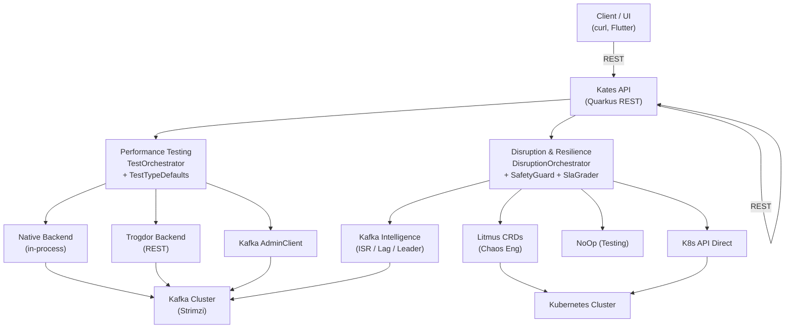

# Kates — Kafka Advanced Testing & Engineering Suite

Every engineering team that runs Apache Kafka in production will eventually face the same question: "How do we know this cluster will hold up?" Not just under normal conditions — under the conditions that actually cause outages. Under load spikes, broker failures, network partitions, disk exhaustion, and rolling restarts. The only honest answer is: you do not know, unless you test.

Kates exists to make that testing rigorous, repeatable, and automated. It is a purpose-built backend service for orchestrating Kafka performance tests and chaos engineering experiments. Built on Quarkus — a cloud-native Java framework designed for Kubernetes — Kates provides a uniform REST API for running, monitoring, and analyzing benchmarks against a Strimzi-managed Kafka cluster.

But Kates is not just a wrapper around `kafka-producer-perf-test.sh`. Unlike ad-hoc scripting or one-off benchmarking tools, it is designed from the ground up as a long-lived platform service. It persists test runs in a PostgreSQL database, emits structured telemetry via Micrometer and OpenTelemetry, and integrates directly with the Kubernetes control plane to orchestrate not only performance tests but full-spectrum disruption and resilience validation. It is the difference between checking your car's tire pressure and running it through a crash test lab.

## Why Kates?

Performance testing Kafka in production-like environments is a deceptively complex undertaking. The default approach—writing shell scripts around the `kafka-producer-perf-test.sh` and `kafka-consumer-perf-test.sh` utilities—works for quick spot-checks but falls apart when you need rigor, repeatability, and integration with the rest of your engineering workflow.

Here are the specific problems that Kates was created to solve:

### No Orchestration

When you run `kafka-producer-perf-test.sh` and `kafka-consumer-perf-test.sh` as standalone scripts, each one operates independently. There is no coordination between producers and consumers, no sequencing of test phases, and no unified lifecycle management. If a producer finishes before the consumer, or if one script crashes, the other keeps running without knowing. Kates provides a `TestOrchestrator` that manages the entire lifecycle of a test run—topic creation, producer/consumer task submission, status polling, and result aggregation—as a single atomic operation.

### Limited Test Scenarios

Shell scripts are inherently linear: they start, run at a fixed throughput, and stop. Real-world Kafka workloads are far more dynamic. You need to simulate traffic spikes (a 10x burst that lasts 120 seconds and then drops back to baseline), progressive stress ramps (gradually increasing throughput until the cluster saturates), endurance soak tests (sustained load over hours to detect memory leaks or GC pressure), and capacity probing (systematic throughput escalation to find the break point). Kates models these as seven distinct test types, each with its own execution strategy, default parameters, and multi-phase orchestration logic.

### No Persistence

The `kafka-producer-perf-test.sh` tool writes metrics to standard output. If you do not redirect that output to a file, the results disappear when the terminal closes. Even if you capture them, you end up with unstructured text files that are difficult to compare across test runs. Kates persists every test run in a PostgreSQL database backed by Hibernate ORM and Flyway migrations. Each run records its configuration, per-task metrics (throughput, latency percentiles, error counts), timing, and status transitions. You can query historical results via the REST API at any time.

### No API Integration

Without an API, you cannot integrate performance testing into CI/CD pipelines, dashboards, or automated quality gates. Kates exposes a comprehensive REST API that allows any HTTP client—whether it is `curl`, a Flutter dashboard, a CI runner, or a monitoring system—to submit tests, poll for status, retrieve results, and manage test lifecycle. The API is fully documented via SmallRye OpenAPI with a Swagger UI available in dev mode.

### No Chaos Engineering

Performance testing tells you how your cluster behaves under load, but it does not tell you how it behaves under failure. What happens when a broker pod is killed? When a network partition isolates the leader? When disk fills up on a replica? Kates includes a complete chaos engineering subsystem that goes far beyond simple fault injection. It provides multi-step disruption plans with safety guardrails, Kafka-aware intelligence (targeting specific partition leaders), real-time ISR and consumer lag tracking, Prometheus metrics capture (before/after snapshots), automatic rollback, and formal SLA grading of test results.

### No Resilience Validation

It is not enough to inject faults and hope for the best. You need to know whether your cluster actually recovered, how long it took, whether any data was lost, and whether your SLA thresholds were met. Kates produces structured resilience reports that include per-step recovery timelines, ISR shrinkage/expansion tracking, consumer lag recovery metrics, and worst-case impact deltas. Every disruption test receives a formal letter grade (A through F) based on how the cluster's behavior compared to your defined SLA thresholds.

## High-Level Architecture

The following diagram shows the major subsystems of Kates and how they interact:



Kates is organized into two major subsystems:

**Performance Testing** handles the orchestration of Kafka producer and consumer workloads through pluggable execution backends. This is the traditional benchmarking side of the platform.

**Disruption & Resilience** handles chaos engineering—injecting controlled faults into the Kafka cluster and Kubernetes infrastructure, observing the impact, and grading the recovery against SLA thresholds. This is the chaos engineering side of the platform.

Both subsystems share common infrastructure: the Kafka AdminClient for topic management, the Kubernetes client for pod interaction, PostgreSQL for persistence, and the REST API layer for external access.

## How Performance Testing Works

1. **Client** sends a `POST /api/tests` request specifying a test type (e.g., `LOAD`, `STRESS`, `SPIKE`), optional parameters, and an optional backend preference.

2. **TestOrchestrator** receives the request and applies per-test-type defaults from `TestTypeDefaults`. This CDI bean provides configuration values for each test type, sourced from a three-tier resolution hierarchy: ConfigMap environment variables, `application.properties`, and built-in Java defaults. User-supplied values in the API request always take priority over all three tiers.

3. **TestOrchestrator** creates the necessary Kafka topics via `KafkaAdminService`. Topics are created with the configured partition count, replication factor, and min.insync.replicas.

4. **TestOrchestrator** selects the execution backend—either `native` (in-process Kafka clients using virtual threads) or `trogdor` (Apache Trogdor Coordinator/Agent framework)—and builds backend-agnostic `BenchmarkTask` objects.

5. The chosen **BenchmarkBackend** executes the actual workloads against the Kafka cluster. For the native backend, this means starting virtual threads that directly use the Kafka Producer and Consumer APIs. For the Trogdor backend, this means submitting task specifications to the Trogdor Coordinator via its REST API.

6. **Kates** polls the backend for status updates and aggregates results. When all tasks complete, the test run transitions to `DONE` and the aggregated metrics (throughput, latency percentiles, error counts) are persisted.

## How Disruption Testing Works

1. **Client** sends a `POST /api/disruptions` request with a `DisruptionPlan` — a multi-step blueprint that defines what faults to inject, in what order, with what timing, and what SLA thresholds to grade against.

2. **DisruptionSafetyGuard** validates the plan before any fault is injected. It checks blast radius constraints (e.g., "never affect more than 1 broker at a time"), verifies RBAC permissions for the required Kubernetes operations, and can perform a dry-run simulation that shows exactly what would happen without touching the cluster.

3. **KafkaIntelligenceService** resolves the current state of the cluster. If a step targets the leader of a specific partition, the intelligence service queries the Kafka AdminClient to resolve the broker ID of that partition's leader. It also starts background ISR tracking and consumer lag monitoring threads.

4. **DisruptionOrchestrator** executes each step sequentially. For each step, it captures pre-disruption Prometheus metrics, injects the fault through the configured `ChaosProvider` (Litmus CRDs, direct Kubernetes API calls, or a no-op for testing), waits for the observation window, captures post-disruption metrics, and computes impact deltas.

5. **SlaGrader** evaluates the results against the SLA thresholds defined in the plan. It checks up to 9 metrics (P99 latency, P99.9 latency, average latency, throughput, error rate, data loss percentage, RTO, RPO, and records processed) and produces a letter grade. An "A" means all checks passed. A "B" means fewer than 25% of checks failed. A "C" means 25–50% failed. A "D" means more than 50% failed. An "F" means at least one check hit a "CRITICAL" severity threshold (e.g., latency exceeding 2× the SLA limit).

6. If auto-rollback is enabled (the default) and a step fails to recover within its observation window, the `DisruptionSafetyGuard` automatically rolls back the fault—for example, restoring a scaled-down deployment to its original replica count.

## Execution Backends

Kates uses a pluggable backend architecture for both performance testing and chaos engineering. Each backend implements a simple SPI (Service Provider Interface) and is registered as a CDI bean.

### Performance Test Backends

| Backend | Description | When to Use |
|---------|-------------|-------------|
| `native` | In-process Kafka clients running on virtual threads. Zero external dependencies beyond the Kafka cluster itself. Ideal for development, CI pipelines, and environments where Trogdor is not deployed. | Development, CI, single-node testing |
| `trogdor` | Apache Trogdor Coordinator/Agent framework. Submits workloads to distributed agents that run on separate JVMs, enabling multi-node, high-concurrency load generation that exceeds what a single process can produce. | Production, distributed load generation |

### Chaos Engineering Backends

| Provider | Description | When to Use |
|----------|-------------|-------------|
| `litmus-crd` | Creates Litmus ChaosEngine custom resources in Kubernetes. Litmus handles the actual fault injection lifecycle, including experiment pods, probes, and cleanup. | Full chaos engineering with Litmus installed |
| `kubernetes` | Uses the Kubernetes API directly (e.g., `kubectl delete pod`, scale deployments, apply network policies). No external chaos framework required. | Lightweight chaos, no CRD dependencies |
| `noop` | Simulates fault injection without actually doing anything. Returns synthetic outcomes for testing the orchestration logic. | Unit testing, dry-runs |
| `hybrid` | Routes faults to the best available provider automatically. Prefers Litmus for supported experiment types, falls back to direct Kubernetes API for others. | Production with partial Litmus coverage |

## Pre-Built Playbooks

Kates ships with a catalog of pre-built disruption playbooks loaded from YAML resource files at startup. Each playbook is a curated, multi-step scenario that encodes best practices for testing a specific failure mode:

| Playbook | Category | Description |
|----------|----------|-------------|
| `az-failure` | Infrastructure | Simulates an availability zone failure by draining a node |
| `split-brain` | Network | Creates a network partition between broker pods |
| `storage-pressure` | Storage | Fills disk on a broker to trigger segment rotation and log cleanup |
| `rolling-restart` | Operations | Performs a rolling restart of all broker pods |
| `leader-cascade` | Kafka | Kills the leader of a specific partition and observes the cascade |
| `consumer-isolation` | Network | Isolates a consumer group from the cluster |

Playbooks can be listed and executed via the REST API without writing any JSON manually.

## Quick Start

### Prerequisites

- **Java 25** — Kates uses modern Java features including records, sealed interfaces, and virtual threads
- **Maven 3.8+** — the project uses the Maven Wrapper (`./mvnw`) for consistent builds
- **Kafka cluster** — default bootstrap servers: `krafter-kafka-bootstrap.kafka.svc:9092`
- **PostgreSQL** — required for test run persistence (Quarkus Dev Services can start one automatically in dev mode)

### Build and Run

```bash
cd kates

# Build the project (skip tests for speed)
./mvnw clean package -DskipTests

# Run in dev mode with hot reload and Swagger UI
./mvnw quarkus:dev

# Run all 153 tests
./mvnw test

# Format all Java files with Spotless + Palantir Java Format
./mvnw spotless:apply

# Check formatting in CI (fails if any file is not formatted)
./mvnw spotless:check
```

### Dev Mode Features

When running in dev mode (`./mvnw quarkus:dev`), Kates provides several developer-facing tools:

- **Swagger UI** at `http://localhost:8080/q/swagger-ui` — interactive API explorer with all endpoints documented via OpenAPI annotations
- **Health** at `http://localhost:8080/q/health` — liveness and readiness probes showing Kafka connectivity status and backend availability
- **OpenAPI spec** at `http://localhost:8080/q/openapi` — machine-readable OpenAPI 3.0 specification for code generation

## Configuration

Kates uses MicroProfile Config for all configuration, which means every property can be set via Java system properties, environment variables (ConfigMap), `application.properties`, or `@ConfigProperty` defaults—in that priority order.

### Core Settings

| Property | Default | Description |
|----------|---------|-------------|
| `kates.kafka.bootstrap-servers` | `krafter-kafka-bootstrap.kafka.svc:9092` | Kafka bootstrap servers. This is the address Kates uses to connect to the Kafka cluster for AdminClient operations and native backend test execution. |
| `kates.trogdor.coordinator-url` | `http://trogdor-coordinator:8889` | Trogdor Coordinator REST endpoint. Only needed when using the `trogdor` backend. |
| `kates.engine.default-backend` | `native` | Default execution backend for performance tests. Can be `native` or `trogdor`. Individual test requests can override this. |
| `kates.chaos.provider` | `hybrid` | Default chaos engineering provider. Can be `litmus-crd`, `kubernetes`, `noop`, or `hybrid`. |

### Per-Test-Type Defaults

Each of the seven test types has its own set of configurable defaults. These are set via properties using the pattern `kates.tests.{type}.{param}` or via ConfigMap environment variables using the pattern `KATES_TESTS_{TYPE}_{PARAM}`.

The following table lists all available parameters and their global default values (used as fallbacks when a test type does not override a specific parameter):

| Parameter | Global Default | Description |
|-----------|---------------|-------------|
| `partitions` | `3` | Number of partitions for the test topic. Higher values enable greater parallelism and throughput but increase broker metadata overhead. |
| `replication-factor` | `3` | Number of replicas for each partition. A value of 3 ensures data survives the loss of 2 brokers. |
| `min-insync-replicas` | `2` | Minimum number of replicas that must acknowledge a write for it to be considered committed. Combined with `acks=all`, this provides strong durability guarantees. |
| `acks` | `all` | Producer acknowledgment mode. `all` means the leader waits for all in-sync replicas to acknowledge. `1` means only the leader acknowledges. `0` means fire-and-forget. |
| `batch-size` | `65536` | Producer batch.size in bytes. Larger batches improve throughput at the cost of higher memory usage and slightly higher latency. |
| `linger-ms` | `5` | Producer linger.ms. The producer waits this many milliseconds to accumulate more records before sending a batch. Higher values improve batching efficiency. |
| `compression-type` | `lz4` | Producer compression codec. LZ4 offers the best balance of CPU overhead and compression ratio for Kafka workloads. Alternatives: `snappy`, `gzip`, `zstd`, `none`. |
| `record-size` | `1024` | Default message payload size in bytes. This is the size of each individual record produced during the test. |
| `num-records` | `1000000` | Total number of messages to produce during the test. |
| `throughput` | `-1` | Target messages per second. `-1` means unlimited (produce as fast as possible). |
| `duration-ms` | `600000` | Test duration in milliseconds (default: 10 minutes). |
| `num-producers` | `1` | Number of concurrent producer tasks. Each task runs in its own virtual thread. |
| `num-consumers` | `1` | Number of concurrent consumer tasks. Each task runs in its own virtual thread. |

These defaults can be overridden per test type in `application.properties`:

```properties
kates.tests.stress.partitions=6
kates.tests.stress.num-producers=3
kates.tests.volume.record-size=10240
kates.tests.roundtrip.compression-type=none
```

Or via ConfigMap environment variables in Kubernetes:

```yaml
KATES_TESTS_STRESS_PARTITIONS: "6"
KATES_TESTS_STRESS_NUM_PRODUCERS: "3"
KATES_TESTS_VOLUME_RECORD_SIZE: "10240"
KATES_TESTS_ROUNDTRIP_COMPRESSION_TYPE: "none"
```

See [Deployment Guide](deployment.md) for the full ConfigMap reference and resolution order.

## Technology Stack

| Component | Version | Purpose |
|-----------|---------|---------|
| Quarkus | 3.31.3 | Cloud-native application framework with CDI, REST, health, and dev services |
| Java | 25 | Language runtime — records, sealed interfaces, virtual threads, pattern matching |
| Kafka Clients | 4.2.0 | AdminClient for topic management, producer/consumer for native backend execution |
| Hibernate ORM + Panache | (managed) | JPA persistence for test runs, disruption reports, and schedules |
| Flyway | (managed) | Database migration management |
| PostgreSQL | (managed) | Persistent storage backend |
| Jackson | (managed) | JSON and YAML serialization/deserialization |
| MicroProfile REST Client | (managed) | Trogdor Coordinator REST API integration |
| MicroProfile Config | (managed) | Configuration resolution from ConfigMap, env vars, properties, and defaults |
| SmallRye Health | (managed) | Kubernetes liveness and readiness health check probes |
| SmallRye OpenAPI | (managed) | Swagger UI and OpenAPI 3.0 specification generation |
| Micrometer | (managed) | Application metrics (counters, gauges, timers) |
| OpenTelemetry | (managed) | Distributed tracing |
| Kubernetes Client (Fabric8) | (managed) | Pod watching, deployment scaling, RBAC checks |
| Spotless + Palantir Java Format | 3.2.1 / 2.87.0 | Automated code formatting enforced in CI |
| JUnit 5 | (managed) | Testing framework |
| Mockito | (managed) | Mock injection for integration tests |
| REST Assured | (managed) | HTTP endpoint testing |

## What's Next

- [Architecture](architecture.md) — detailed package structure, class responsibilities, and design decisions
- [Test Types](test-types.md) — in-depth guide to all seven performance test types
- [API Reference](api-reference.md) — complete REST API documentation with examples
- [Deployment Guide](deployment.md) — Kubernetes manifests, ConfigMap reference, and Trogdor setup
- [Testing Guide](testing.md) — how to run, write, and understand the test suite
