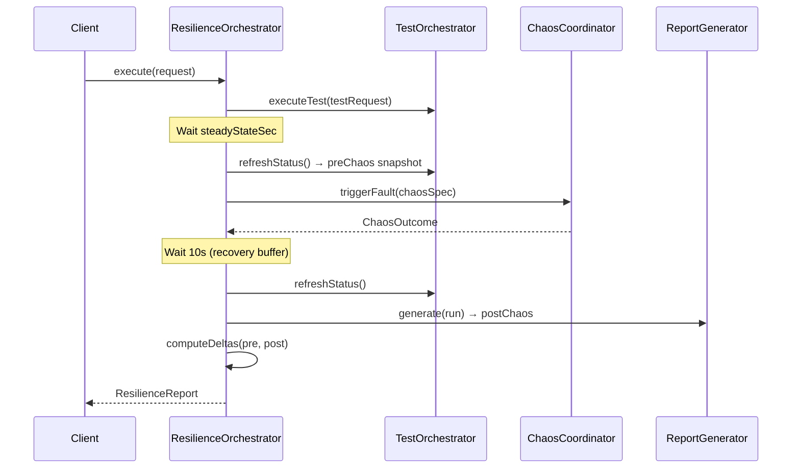

# Resilience Testing

This document covers Kates' resilience testing subsystem — a higher-level orchestration that combines performance testing with chaos engineering in a single coordinated workflow. While disruption testing focuses solely on fault injection and recovery, resilience testing answers the question: "How does system performance degrade during and after a failure?"

## Concept

A resilience test runs a performance benchmark and a chaos experiment simultaneously, then computes the performance impact by comparing pre-chaos and post-chaos metrics. This gives you a quantitative measure of your system's resilience.



The orchestration follows 9 steps:

1. **Start benchmark** — the performance test begins running in the background
2. **Wait for steady state** — a configurable delay (default 30s) ensures the benchmark reaches stable throughput before fault injection
3. **Snapshot pre-chaos metrics** — the orchestrator captures throughput, latency, error rate before the fault
4. **Inject fault** — the `ChaosCoordinator` triggers the specified fault
5. **Wait for fault completion** — blocks until the chaos experiment completes (duration + 60s timeout)
6. **Recovery buffer** — a 10-second pause allows the system to begin recovering
7. **Generate final report** — the performance test results are finalized into a `TestReport`
8. **Compute impact deltas** — percentage change for each metric between pre-chaos and post-chaos snapshots
9. **Check data integrity** — if the test type supports it, extract integrity verification results

## API

### Execute a Resilience Test

```
POST /api/resilience
Content-Type: application/json
```

**Request Body:**

```json
{
  "testRequest": {
    "type": "LOAD",
    "backend": "native",
    "spec": {
      "topic": "resilience-test",
      "numProducers": 2,
      "numConsumers": 2,
      "numRecords": 500000,
      "throughput": 10000,
      "recordSize": 1024,
      "partitions": 6,
      "replicationFactor": 3,
      "acks": "all"
    }
  },
  "chaosSpec": {
    "experimentName": "broker-kill-during-load",
    "disruptionType": "POD_KILL",
    "targetTopic": "resilience-test",
    "targetPartition": 0,
    "chaosDurationSec": 0,
    "gracePeriodSec": 0
  },
  "steadyStateSec": 60
}
```

**Field reference:**

| Field | Type | Required | Description |
|-------|------|----------|-------------|
| `testRequest` | `CreateTestRequest` | Yes | Performance test definition (same format as `POST /api/tests`) |
| `chaosSpec` | `FaultSpec` | Yes | Fault injection specification (see [Disruption Guide](disruption-guide.md)) |
| `steadyStateSec` | `int` | No | Seconds to wait for steady state before injecting fault (default: 30) |

**Response: `200 OK`**

```json
{
  "status": "COMPLETED",
  "performanceReport": {
    "run": { "id": "abc123", "testType": "LOAD", "status": "DONE", "..." },
    "summary": {
      "totalRecords": 500000,
      "avgThroughputRecPerSec": 9500.0,
      "peakThroughputRecPerSec": 12000.0,
      "avgLatencyMs": 5.2,
      "p99LatencyMs": 25.0,
      "errorRate": 0.1
    }
  },
  "chaosOutcome": {
    "status": "COMPLETED",
    "message": "Pod krafter-kafka-1 killed successfully",
    "durationMs": 5000
  },
  "preChaosSummary": {
    "avgThroughputRecPerSec": 10200.0,
    "avgLatencyMs": 3.8,
    "p99LatencyMs": 12.0,
    "errorRate": 0.0
  },
  "postChaosSummary": {
    "avgThroughputRecPerSec": 8800.0,
    "avgLatencyMs": 6.5,
    "p99LatencyMs": 35.0,
    "errorRate": 0.2
  },
  "impactDeltas": {
    "throughputRecPerSec": -13.73,
    "avgLatencyMs": 71.05,
    "p99LatencyMs": 191.67,
    "maxLatencyMs": 450.00,
    "errorRate": 100.00
  },
  "integrityResult": null
}
```

## Understanding the Impact Deltas

The `impactDeltas` map shows the percentage change for each metric between the pre-chaos and post-chaos snapshots. The computation uses:

```
delta = ((postValue - preValue) / preValue) × 100%
```

**Interpreting the values:**

| Metric | Negative Delta | Positive Delta |
|--------|---------------|----------------|
| `throughputRecPerSec` | **Bad** — throughput dropped | Good — throughput increased (unlikely during chaos) |
| `avgLatencyMs` | Good — latency improved | **Bad** — latency increased |
| `p99LatencyMs` | Good — tail latency improved | **Bad** — tail latency increased |
| `maxLatencyMs` | Good — worst-case improved | **Bad** — worst-case worse |
| `errorRate` | Good — fewer errors | **Bad** — more errors |

In the example above, the broker kill caused a 13.73% throughput drop, a 71% average latency increase, and a nearly 3× P99 latency increase. The error rate went from 0% to 0.2%.

## Resilience vs Disruption Testing

| Aspect | Disruption Testing | Resilience Testing |
|--------|-------------------|--------------------|
| **Focus** | Fault injection and cluster recovery | Performance impact during failures |
| **Endpoint** | `POST /api/disruptions` | `POST /api/resilience` |
| **Benchmark** | Not included (fault only) | Performance test runs concurrently |
| **Metrics** | ISR tracking, lag, Prometheus snapshots | Pre/post performance comparison |
| **Output** | `DisruptionReport` with SLA grading | `ResilienceReport` with impact deltas |
| **Best for** | "Can the cluster survive this?" | "How much does performance degrade?" |

## Status Values

| Status | Meaning |
|--------|---------|
| `COMPLETED` | Benchmark finished and chaos resolved successfully |
| `CHAOS_FAILED` | Fault injection failed or chaos outcome was not a pass |
| `INTERRUPTED` | Test was interrupted (thread interruption) |
| `ERROR` | An unexpected exception occurred |
