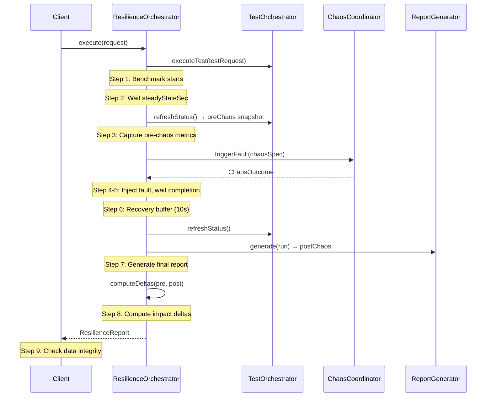

# Resilience Testing

Performance testing tells you how fast your system is. Disruption testing tells you whether your system can survive a failure. But neither, by itself, answers the question that matters most: *how badly does performance degrade when something goes wrong?*

That is the question resilience testing answers. A resilience test runs a performance benchmark and a chaos experiment simultaneously, then compares the performance metrics before and after the fault to quantify the impact. Instead of vague assurances like "the cluster recovered," you get precise measurements: "throughput dropped 13.7%, P99 latency increased 191%, and recovery took 45 seconds."

This chapter explains the theory behind resilience testing, walks you through the API, and teaches you how to interpret the results.

## Why Combine Performance and Chaos?

Consider two separate test results:

1. **Performance test:** Throughput = 50,000 rec/s, P99 latency = 12ms, error rate = 0%
2. **Disruption test:** Broker killed, ISR recovered in 30 seconds, no data loss, Grade A

Both results look great. But they tell you nothing about the interaction between load and failure. What if the P99 latency spikes to 2 seconds during the 30-second recovery? What if the error rate briefly hits 5%? What if 50,000 rec/s is sustainable under normal conditions but the cluster cannot maintain even 20,000 rec/s during a broker election?

These questions cannot be answered by running performance tests and disruption tests separately. You need to run them at the same time and measure the overlap. That is resilience testing.

The concept is formalized in the SRE community as a "game day" — a structured exercise where you apply realistic load to a system and then inject failures to observe the combined effect. Kates automates this process, making it repeatable, quantifiable, and suitable for CI/CD integration.

## The Resilience Orchestration Pipeline

The `ResilienceOrchestrator` coordinates the entire resilience test through a 9-step pipeline:



Let's walk through each step and understand the reasoning behind it:

**Step 1: Start the benchmark.** The performance test begins running in the background, sending messages at steady throughput. This is identical to a regular `POST /api/tests` — the benchmark runs independently and does not know about the impending chaos.

**Step 2: Wait for steady state.** This is the most important step for result quality. The orchestrator pauses for `steadyStateSec` (default 30) to let the benchmark reach stable throughput. Why? Because the first few seconds of any Kafka benchmark are dominated by producer warmup — connection establishment, metadata fetching, batch buffer filling. If you inject a fault during warmup, you cannot distinguish between "the cluster degraded due to the fault" and "the cluster was still warming up." The steady-state wait eliminates this confound.

**Step 3: Snapshot pre-chaos metrics.** The orchestrator captures a `ReportSummary` from the current benchmark state. This snapshot includes throughput, average latency, P99 latency, and error rate — these become the baseline for comparison.

**Step 4: Inject the fault.** The `ChaosCoordinator` triggers the specified fault using the configured `ChaosProvider`. This is identical to a regular disruption — pod kill, network partition, disk fill, whatever the `chaosSpec` describes.

**Step 5: Wait for fault completion.** The orchestrator blocks until the `ChaosOutcome` future completes, with a timeout of chaosDuration + 60 seconds. For instant faults like `POD_KILL`, this resolves almost immediately. For duration-based faults like `NETWORK_PARTITION`, it waits for the full chaos duration.

**Step 6: Recovery buffer.** A deliberate 10-second pause after the fault completes. This exists because recovery is not instantaneous — the killed broker needs to restart, the ISR needs to expand, producers need to refresh their metadata. The 10-second buffer gives the cluster a head start on recovery before we take the post-chaos snapshot.

**Step 7: Generate the final report.** The benchmark results are finalized into a `TestReport` with complete per-task metrics.

**Step 8: Compute impact deltas.** The orchestrator calculates the percentage change between pre-chaos and post-chaos snapshots for each metric.

**Step 9: Check data integrity.** If the test type supports integrity verification (ROUND_TRIP with sequence-numbering enabled), the orchestrator extracts the integrity results to check for lost or duplicated messages.

## The API

### Execute a Resilience Test

```
POST /api/resilience
Content-Type: application/json
```

**Request body:**

```json
{
  "testRequest": {
    "type": "LOAD",
    "backend": "native",
    "spec": {
      "topic": "resilience-test",
      "numProducers": 2,
      "numConsumers": 2,
      "numRecords": 500000,
      "throughput": 10000,
      "recordSize": 1024,
      "partitions": 6,
      "replicationFactor": 3,
      "acks": "all"
    }
  },
  "chaosSpec": {
    "experimentName": "broker-kill-during-load",
    "disruptionType": "POD_KILL",
    "targetTopic": "resilience-test",
    "targetPartition": 0,
    "chaosDurationSec": 0,
    "gracePeriodSec": 0
  },
  "steadyStateSec": 60
}
```

The request combines three things:

1. **`testRequest`** — The performance test definition, identical to what you would send to `POST /api/tests`. This defines the workload that will be running when the fault hits.
2. **`chaosSpec`** — The fault specification, identical to what you would use in a disruption plan. This defines what breaks.
3. **`steadyStateSec`** — How long to wait for the benchmark to stabilize before injecting the fault. A longer wait produces more accurate baselines but increases total test duration.

### Understanding the Response

The `ResilienceReport` contains five sections:

```json
{
  "status": "COMPLETED",
  "performanceReport": { "..." },
  "chaosOutcome": { "..." },
  "preChaosSummary": {
    "avgThroughputRecPerSec": 10200.0,
    "avgLatencyMs": 3.8,
    "p99LatencyMs": 12.0,
    "errorRate": 0.0
  },
  "postChaosSummary": {
    "avgThroughputRecPerSec": 8800.0,
    "avgLatencyMs": 6.5,
    "p99LatencyMs": 35.0,
    "errorRate": 0.2
  },
  "impactDeltas": {
    "throughputRecPerSec": -13.73,
    "avgLatencyMs": 71.05,
    "p99LatencyMs": 191.67,
    "maxLatencyMs": 450.00,
    "errorRate": 100.00
  }
}
```

**`preChaosSummary`** is the snapshot captured just before fault injection, after the benchmark reached steady state. This is your baseline — what performance looks like when everything is working.

**`postChaosSummary`** is the snapshot captured after the fault and recovery buffer. This reflects the combined impact of the fault and any degradation that persisted after recovery.

**`impactDeltas`** is the heart of the report — the percentage change for each metric:

```
delta = ((postValue - preValue) / preValue) × 100%
```

## Interpreting Impact Deltas

Reading impact deltas requires understanding that different metrics have different "polarity" — for some metrics, a positive delta is bad, while for others, it is good:

| Metric | Negative Δ | Positive Δ | Bad Direction |
|--------|------------|------------|---------------|
| Throughput | **Bad** — throughput dropped | Good (unlikely during chaos) | ← |
| Avg Latency | Good — latency improved | **Bad** — latency increased | → |
| P99 Latency | Good — tail latency improved | **Bad** — tail latency increased | → |
| Max Latency | Good — worst case improved | **Bad** — worst case worsened | → |
| Error Rate | Good — fewer errors | **Bad** — more errors | → |

In the example above:

- **Throughput dropped 13.73%.** This means the cluster went from 10,200 rec/s to 8,800 rec/s during the disruption — a meaningful but manageable degradation.
- **Average latency increased 71%.** The average went from 3.8ms to 6.5ms. This is noticeable but probably within acceptable bounds for most applications.
- **P99 latency increased 191.67%.** The tail latency nearly tripled, going from 12ms to 35ms. This is the most important metric for user-facing applications — it tells you what the slowest requests experienced.
- **Error rate increased to 0.2%.** The cluster went from zero errors to a 0.2% error rate. This likely represents the brief window during leader election when some produce requests failed before the producer's metadata refreshed.

### What is a "Good" Result?

There is no universal threshold for acceptable degradation — it depends entirely on your application's requirements. But here are some general guidelines based on industry practice:

| Impact Level | Throughput Δ | P99 Latency Δ | Error Rate Δ |
|-------------|-------------|---------------|-------------|
| Excellent | < 5% drop | < 50% increase | 0% increase |
| Acceptable | 5-20% drop | 50-200% increase | < 1% increase |
| Concerning | 20-50% drop | 200-500% increase | 1-5% increase |
| Critical | > 50% drop | > 500% increase | > 5% increase |

## Resilience vs. Disruption Testing: When to Use Which

Both forms of testing have their place. Understanding when to use each saves time and produces better results:

| Question | Use |
|----------|-----|
| "Can the cluster survive this failure?" | Disruption test |
| "How much does performance degrade during failure?" | Resilience test |
| "Does ISR recovery work correctly?" | Disruption test |
| "Will our SLA hold during a broker restart?" | Resilience test |
| "Are our timeout settings correct?" | Disruption test |
| "What is the P99 latency impact of losing a broker?" | Resilience test |

As a rule of thumb: use disruption testing when you care about the cluster's behavior (ISR, leader election, recovery time). Use resilience testing when you care about the application's experience (throughput, latency, errors) during the same failures.

## Tutorial: Running Your First Resilience Test

Here is a complete walkthrough for running a resilience test against a broker kill:

### 1. Choose Your Workload

Start with a LOAD test that represents your production workload. If your application produces 10,000 messages/second with 1KB messages, use those numbers:

```bash
curl -X POST http://localhost:8080/api/resilience \
  -H 'Content-Type: application/json' \
  -d '{
    "testRequest": {
      "type": "LOAD",
      "spec": {
        "topic": "resilience-demo",
        "numProducers": 2,
        "numConsumers": 1,
        "numRecords": 300000,
        "throughput": 10000,
        "recordSize": 1024,
        "partitions": 6,
        "replicationFactor": 3,
        "acks": "all"
      }
    },
    "chaosSpec": {
      "experimentName": "kill-during-load",
      "disruptionType": "POD_KILL",
      "targetTopic": "resilience-demo",
      "targetPartition": 0,
      "gracePeriodSec": 0
    },
    "steadyStateSec": 30
  }'
```

### 2. Wait for Results

The test takes approximately 90 seconds: 30s steady state + 0s fault (instant kill) + 10s recovery buffer + benchmark completion time. The response is a full `ResilienceReport`.

### 3. Check the Impact Deltas

Look at the `impactDeltas` first:
- If throughput dropped less than 10% and P99 increased less than 100%, your cluster handles single-broker failures well.
- If throughput dropped more than 50% or P99 increased more than 500%, you may have a configuration issue (`min.insync.replicas` too high, `acks=all` with too few brokers, or producer retry settings that are not aggressive enough).

### 4. Iterate with Different Faults

Once you have your baseline, try different chaos specs: `NETWORK_PARTITION` for 30 seconds, `ROLLING_RESTART`, or `SCALE_DOWN`. Each fault type produces a different impact profile, and comparing them reveals which failure modes your system handles well and which need attention.

## Status Reference

| Status | Meaning |
|--------|---------|
| `COMPLETED` | Benchmark finished and chaos resolved successfully |
| `CHAOS_FAILED` | Fault injection failed or chaos outcome was not a pass |
| `INTERRUPTED` | Test was interrupted by thread cancellation |
| `ERROR` | Unexpected exception during orchestration |
