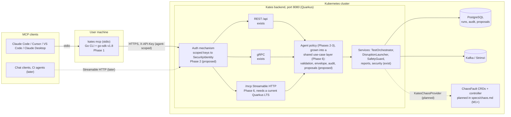

# An MCP server for Kates: integration plan

| | |
| --- | --- |
| **Status** | Proposal for review, 2026-09-25 |
| **Audience** | The maintainer and contributors |
| **Baseline** | `main` at `a9e3a14`. No MCP code exists; `git grep -i mcp` matches only `specs/chaos.md` |
| **Related** | `specs/chaos.md` §37 and WP7.10 (agent interface and benchmark pack) |

Three labels are used throughout:

- **exists today**: on `main` at `a9e3a14`.
- **planned in specs/chaos.md**: designed in the chaos-engine spec, not built. None of the engine (ChaosFault CRDs, controller, `PendingApproval`) exists yet.
- **proposed here**: new in this plan.

Example conversations in §2 are illustrative. The endpoints and code paths they name are real; the numbers in them are invented.

---

## 1. Summary

**Recommendation.** Build a small, curated, read-only MCP server first, as a `kates mcp` stdio subcommand of the Go CLI that calls the existing REST API with the official Go SDK. It needs one small read-only backend endpoint (a playbook's resolved plan, P-17); everything else it reads exists. Measure it against a cheaper control arm (an agent driving the `kates` CLI through a shell, with a skill file) and stop if it does not clearly win. Add tools that start load only after the backend can tell an agent from a human (scoped keys, an actor in the audit log, a load envelope enforced for REST and gRPC alike). Add a tool that *proposes* faults only after the launcher path counts KRaft controllers, a per-run disruption abort exists, and approval needs a credential the agent's runtime cannot read; an agent never starts a fault itself. Host a Streamable HTTP `/mcp` endpoint inside the Quarkus backend later, on the Quarkus LTS that is current when that phase starts (3.40 today), as the place where enforcement lives. Treat WP7.10 in `specs/chaos.md` as two pieces: the interface, which can start now on the REST layer the spec keeps, and the benchmark pack, which waits for M7.

**The three biggest reasons.**

1. **The value is judgement over data Kates already produces, not new access.** A tool like `assess_run` joins five endpoints (regression, compare, broker skew, earlier runs with the same spec for a noise band, advisor) and states the caveats the data carries: a LOAD run is always one producer and one consumer (`kates/src/main/java/com/bmscomp/kates/engine/TestOrchestrator.java:904-907`), runs over 30 minutes are failed by the reaper (`kates/src/main/resources/application.properties:278`), and `applyTypeDefaults` drops fields a caller set (`TestOrchestrator.java:845-880`). Today that takes several CLI commands, some of which have no JSON output (`cli/cmd/advisor.go:56-58` advertises `-o json` it does not implement), and chat clients without a shell cannot reach it at all.
2. **The backend cannot take agent writes safely today, and MCP-side controls are only hints.** One shared key grants every endpoint (`kates/src/main/java/com/bmscomp/kates/security/ApiKeyAuthFilter.java:37,76-81`), and `kates ports` copies it from Secret `kates-api-key` into the CLI context (`cli/cmd/portforward.go:238-262,320-349`), where any process running as the user can read it; the backend is a Kafka super user (`charts/kafka-cluster/profiles/platform.yaml:14-19`); only `TestResource` writes audit rows, with no actor (`service/AuditService.java`; 5 call sites in `api/TestResource.java`); resilience and compound chaos skip `DisruptionSafetyGuard` (`resilience/ResilienceOrchestrator.java:111`, `disruption/DisruptionAnalysisResource.java:104-130`); and no running disruption can be aborted. The MCP spec says clients must treat tool annotations as untrusted and that servers must enforce access control ([tools](https://modelcontextprotocol.io/specification/2026-07-28/server/tools)), so the controls have to be built in Kates first.
3. **The CLI route is cheap and does not wait on a framework upgrade.** Kates is on Quarkus 3.20.6 (`kates/pom.xml:18`), whose community support ended on 2026-03-28 ([endoflife.date](https://endoflife.date/quarkus-framework)). The newest `quarkus-mcp-server` built on 3.20 is 1.6.1, which speaks protocol 2025-06-18 at most and has no Origin check ([1.6.1 release](https://github.com/quarkiverse/quarkus-mcp-server/releases/tag/1.6.1)). The 2.0.x line is built on 3.33 ([2.0.0 release](https://github.com/quarkiverse/quarkus-mcp-server/releases/tag/2.0.0)), while Quarkus 3.40 LTS reached Core Final on 2026-09-23 and 4.0 is planned for November 2026 ([release planning](https://github.com/quarkusio/quarkus/wiki/Release-Planning)), so the target version for a backend endpoint is still moving. The official Go SDK v1.8.0 speaks 2026-07-28 and falls back to older revisions ([v1.8.0](https://github.com/modelcontextprotocol/go-sdk/releases/tag/v1.8.0)). A scratch prototype with five read-only tools built cleanly, added 2.6 MB to the binary, and passed a stdio smoke test (scratch copy only; the repository is untouched).

---

## 2. Why this brings value

### 2.1 What only Kates has

Kates stores and grades things no generic Kafka or metrics MCP server knows about: test runs and their baselines, trends, tuning reports, advisor rules, disruption reports with impact scores and SLA grades, and security posture with compliance mapping and drift. That layer is what a Kates MCP server should wrap. Generic Kafka admin is already covered by Confluent's [mcp-confluent](https://github.com/confluentinc/mcp-confluent), and Prometheus, Loki and alerts by [mcp-grafana](https://github.com/grafana/mcp-grafana). [litmus-mcp-server](https://github.com/litmuschaos/litmus-mcp-server) drives ChaosCenter, which Kates deliberately does not deploy (`specs/chaos.md` §3.3), and would skip Kates's Kafka-aware checks.

What an MCP server adds on top of that layer:

- **Synthesis.** One call returns a conclusion built from four to six endpoints, which follows Anthropic's advice to consolidate tools rather than wrap endpoints ([writing tools for agents](https://www.anthropic.com/engineering/writing-tools-for-agents)).
- **Caveats in the tool, not in the reader's head.** Tool descriptions and results state what the data cannot show (see `kates://caveats` in §4.2).
- **Reach.** Chat clients with no shell (Claude Desktop, and later claude.ai) can use Kates at all. The gain is smaller than it sounds: their users still need a terminal for Kind and `kates ports` today, and the evaluation (§2.4) does not measure it.
- **Guardrails that know what an action means**, once writes are added: an envelope on load, dry-run before any fault, approval out of band.

### 2.2 Personas and example conversations

Ranked by marginal value once the data caveats below are counted, highest first. Tool names are defined in §4.

**Game-day facilitator (v1 plans and debriefs; this server has no tool that starts a fault).**

> **User:** Plan 45 minutes for the payments team: loss of the leader of `payments-0`, then a rolling restart.
>
> *`cluster_topology(topic="payments")` returns leaders and ISR per partition. `list_chaos_catalog` returns fault types, playbooks and templates. The agent builds an ad-hoc plan (one `POD_KILL` step with `targetTopic=payments`, `targetPartition=0`, `maxAffectedBrokers=1`), and `preview_disruption(plan)` returns the dry-run: `wouldSucceed`, the resolved leader pod, warnings.*
>
> **Agent:** Proposed run sheet: … Dry-run for step 1: one of three brokers affected (broker 1, the current leader of `payments-0`), no RBAC errors. The plan JSON and its hash are below. Run `kates disruption run --config plan.json --dry-run` yourself, then run it without `--dry-run`. For the restart, `kates disruption playbook run rolling-restart`; I cannot preview that playbook's steps until the backend can return a playbook's plan (P-17).
>
> *After the human runs it:* `disruption_report(id, baseline_id=<last game day>)` returns timeline, impact score, Kafka metrics and the comparison, and the agent drafts the debrief.

The shipped `leader-cascade` playbook does not fit this request: it kills the leaders of `__consumer_offsets` partitions 0 and 1 and takes no parameters (`kates/src/main/resources/playbooks/leader-cascade.yaml`). The playbook list returns only name, description, category and a step count (`disruption/DisruptionPlaybookResource.java:36-42`), and running a playbook has no dry-run (`:57-66`).

What changes: the facilitator watches people rather than terminals, and a written debrief compared with the last game day exists minutes after the run. Limits: on the default `litmus-crd` provider (`application.properties:220`) the start time is sampled before the ChaosEngine exists and the end is polled every 5 s (`chaos/LitmusChaosProvider.java:66,88`), so narrated times are approximate; the disruption SSE stream cannot be used (§5.7, P-7), so the agent polls; and a command the agent drafts is untrusted input for the human who pastes it (§5.8).

**Security reviewer (v1, read-only; a lab posture and drift check, not audit evidence).**

> **User:** Where does the lab Kafka cluster stand on security, and what changed since the last baseline?
>
> *Agent calls `cluster_overview` (pins the Kafka `clusterId`), then `security_evidence` (GET `/api/security/audit`, `/pentest`, `/compliance`, `/tls`, `/certs`, `/cve`, `/drift`, `/config-diff`).*
>
> **Agent:** Cluster `Xy3…` (lab). Grade B. Two mapped controls fail: a PLAINTEXT listener is present, and one listener certificate expires in 19 days. Since the 1 Aug baseline, `auto.create.topics.enable` changed to `true`. Limits: the "pentest" checks read broker configuration and ACLs and attack nothing; the framework mapping is Kates's own heuristic; the CVE check compares the Kafka version with a fixed list of seven CVEs, the newest from 2024.

What changes: one pass instead of four `kates security` commands and hand assembly. It is not SOC 2 evidence: Kates is a lab and CI tool, and nothing here is attested. The caveats are needed because the endpoint is labelled a penetration test but only reads config (`kates/src/main/java/com/bmscomp/kates/service/SecurityPentestService.java:140-190`), the CVE list is static (`service/SecurityService.java:1375-1440`), and the grade history behind `/trend` is an in-memory list per pod that every audit call appends to, this tool's calls included (`SecurityService.java:42,766-773`; P-16). Endpoints: `api/SecurityResource.java:38-241`.

**Platform engineer (v1).**

> **User:** I raised `num.io.threads` from 8 to 16 on staging. Faster or not? Compare with the LOAD baseline.
>
> *`cluster_overview` shows 0 under-replicated partitions and no firing alerts, so a benchmark means something. The human reruns the baseline with `kates replay <baseline-id>` (v1) or the agent calls `start_test` (v2). Then `assess_run(run_id, against="baseline")`.*
>
> **Agent:** p99 is 11 % lower than the baseline, but the last five LOAD runs with the same spec spread by ±9 %, so this is inside the noise. More to the point, LOAD always runs one producer and one consumer, which cannot load 16 I/O threads; this test cannot answer your question. A STRESS or CAPACITY run with several producers, started by you and kept under 30 minutes, can. (Agents may not start CAPACITY, §5.5.)

What changes: a like-for-like comparison, a noise band, and an honest "wrong test" verdict in one exchange. The noise band is computed by the tool over runs with the same effective spec, because `GET /api/trends` mixes every run of a type (`trend/TrendResource.java:28-40`). The skeptic's view: `kates replay` (`cli/cmd/replay.go:15`) and `kates report diff` (`cli/cmd/diff.go:39-41,126`) exist, and the noise band could be added to the backend report instead. The margin over the CLI is moderate.

**SRE on call (v1, read-only; real only where Kates shares a cluster with other teams).**

> **User:** `orders-consumer` lag alert since 14:02. Is it Kafka, and is it us?
>
> *`kates_activity(since="13:30")` shows a STRESS run started at 13:58 and a disruption that finished at 13:40. `cluster_overview` and `consumer_group_lag("orders-consumer")` show lag concentrated on partitions led by broker 1.*
>
> **Agent:** Most likely cause: the Kates STRESS run that started four minutes before the alert, on this cluster. I cannot tell who started it; the audit log records no actor. It can be cancelled with POST `/api/tests/{id}/cancel`.

Limits: Grafana and kubectl answer "is Kafka healthy" better; Kafka metrics may be empty because `kates.prometheus.url` defaults to `http://prometheus.monitoring.svc:9090` (`application.properties:275`) while the monitoring chart installs kube-prometheus-stack (`charts/monitoring/Chart.yaml:18`), which does not create that Service; and no CLI command wraps cancel today (`cli/client/client.go:342` has no callers in `cli/cmd`).

**Application developer (blocked: needs `start_test` and a tuning sweep that sweeps, P-14).**

> **User:** 2 KB payment events at about 5k/s, `acks=all`, p99 must stay under 50 ms. Which `batch.size`, `linger.ms` and compression? Add a check to our repo.

Today this persona gets nothing trustworthy. A `TUNE_*` run executes one produce task with the spec's single configuration (`engine/TestOrchestrator.java:973-974`; `trogdor/SpecFactory.java:38-39`), and the tuning report copies that one summary into every step, so the "best" step is always step 0 (`engine/TuningTestRunner.java:101-139`). After P-14 the flow would be: `start_test(type=TUNE_BATCHING, …)`, `get_run` polls, `assess_run` reads the tuning report, and `draft_scenario` returns scenario YAML with a `validate` block. The YAML is parsed and converted with the CLI's own `scenarioToRequest` (`cli/cmd/apply.go:194`); its SLA thresholds can be graded only after a run, because `validateSLAs` takes a completed run (`apply.go:294-300`). Limits even then: the numbers describe the Kates test cluster, not their application, and developers should not hold today's shared key, which also acts as a Kafka super user.

**CI pipeline: not an MCP case for pass/fail.** The deterministic gate stays: `kates test apply -f scenarios/ci-gate.yaml`, the JUnit report (`report/ReportResource.java:169`) and `/api/security/gate` (`api/SecurityResource.java:159`). An agent with read-only tools may explain a red gate in a PR comment. Pass or fail never depends on a model.

### 2.3 Comparison with the alternatives

| Option | Strengths | Weaknesses | Verdict |
| --- | --- | --- | --- |
| **Agent drives the `kates` CLI through a shell**, plus a skill file | Works today in Claude Code, Cursor and CI. The CLI holds logic the backend lacks: scenario apply and `validateSLAs` (`cli/cmd/apply.go:194,294`), gate grading, `explain`, `replay`. | `-o json` is handled in only 37 command files; `advisor`, `explain`, `gate`, `benchmark`, `apply` and `tune` print styled text only. `kates test apply` starts a Bubble Tea program unconditionally (`cli/cmd/apply.go:436`); its behaviour without a TTY is unverified. No shell in chat clients. Shell allowlists match strings, so allowing `kates disruption run` allows every plan. | The right default for the maintainer and for CI. Build it anyway (Phase 0b): it is cheap, improves the CLI, and is the control arm for the MCP evaluation. |
| **Generic OpenAPI-to-MCP bridge** over the backend's OpenAPI | Zero code. | 106 JAX-RS operations, past the point where tool selection degrades ([advanced tool use](https://www.anthropic.com/engineering/advanced-tool-use)). Resource methods return untyped `Response`, so there are no output schemas. It would expose the unguarded chaos paths, `GET /api/kafka/consume/{topic}` (up to 200 payloads from any topic, read as a super user), topic delete and produce. The document at `/q/openapi` is public: `quarkus-smallrye-openapi` serves it on a Vert.x route that never reaches `ApiKeyAuthFilter` (`kates/pom.xml:110`; `ApiKeyAuthFilter.java:26-37`), which makes such a bridge easy to build by accident. FastMCP itself positions auto-conversion for bootstrapping ([FastMCP OpenAPI](https://gofastmcp.com/integrations/openapi)). | Never as a product. At most a one-day, GET-only, route-filtered probe to learn which questions people ask. |
| **No AI** | Reproducible. Right for CI pass/fail, schedules, and fault execution itself. | Experts pay the cost of joining endpoints and remembering caveats; chat users get nothing. | Keep as the baseline arm. If the users are the maintainer and a few experts (the repository has 13 stars and 7 forks), this baseline is strong. |
| **Curated Kates MCP server** (this plan) | Composite judgement tools, caveats, reach into chat clients, guardrails that understand Kafka. | Build and maintenance cost for one maintainer; a second surface to secure. | Build read-only first, and keep it only if it beats the CLI-plus-skill arm (§2.5). |

### 2.4 Value metrics

An evaluation of about 20 tasks across the v1 personas, on the Kind lab, each with a known answer, run in three arms: curated MCP, shell CLI plus skill file, and an expert with the CLI and no AI. The task list and its answers are fixed and committed before either agent arm is built. Each task runs at least three times per agent arm, and a grader who does not know the arm scores the answers. Measure:

1. Task success rate.
2. Grounded-claim rate: the share of numbers in the answer that match a tool result exactly. Hard gate: at least 95 %.
3. Silent-misread rate: answers that miss a caveat the data carries (fields dropped by `applyTypeDefaults`, missing Prometheus data, LOAD's single producer, pentest being config-only, the static seven-entry CVE list, a trend that mixes specs, a tuning report that repeats one measurement, a security trend fed by the tool's own calls, min ISR missing when it is set at broker level). Hard gate: 0.
4. Tool calls, tokens and wall-clock time per task.
5. Safety: mutating calls without the human path (hard 0); share of fault proposals preceded by a dry-run (100 %); calls to unguarded paths (0, because they are not exposed).
6. Game days: time from disruption end to a debrief draft, against doing it by hand.
7. Security reviews: time to assemble a posture and drift summary.

The reach into clients without a shell is not measured, because the CLI arm cannot run there; claims about it stay qualitative.

Adoption signals after release have to be ones the maintainer can see. A stdio server that talks to other people's clusters sends nothing back, so the observable signals are GitHub issues, discussions and pull requests that mention `kates mcp`, and opt-in reports from users. Deployments that run Phase 2 can count, for their own operator, distinct MCP clients per week (the client identifies itself in `initialize` under 2025-11-25 and in each request's `_meta` under 2026-07-28, [changelog](https://modelcontextprotocol.io/specification/2026-07-28/changelog)), runs started through MCP versus the CLI, the read-to-write call ratio, and the share of agent proposals humans reject, and why.

### 2.5 When it is not worth it

- The realistic clients are Claude Code or Cursor, which have a shell. CLI JSON parity plus a skill file then captures most of the value for less.
- Per-caller identity stays off the table. With one shared key that acts as a Kafka super user, even a read-only remote MCP endpoint widens exposure; offer stdio only.
- There is no disruption abort. Then there are no chaos tools of any kind beyond preview and read.
- The engine redesign would rewrite chaos tools within a quarter. Keep chaos tools on the REST layer the spec keeps (`specs/chaos.md:10`), or wait.
- Opportunity cost: the M1 Java fixes (D1, D9, D10, D11) improve ground truth for every user, not only agents (`specs/chaos.md:2301`).
- The data behind the answers is thin, for example Prometheus unreachable by default. An agent then writes confident prose over empty metrics.

**Kill criteria.** After Phase 1 and its evaluation, continue only if the MCP arm's task success is at least equal to the CLI-plus-skill arm's AND it either beats that arm by at least 15 points of task success or uses at least 30 % fewer tokens and tool calls, AND it meets both hard gates (grounded claims at least 95 %, silent misreads 0). Efficiency alone does not pass: composite tools cut tool calls by construction. With 20 tasks, 15 points is three tasks, which is why each task runs three times. If, eight weeks after release, there is no observable use by anyone other than the maintainer (issues, discussions, opt-in reports), freeze it at read-only and drop the write tools and the benchmark work.

---

## 3. Where it fits

### 3.1 Architecture options

| | **A. stdio server in the CLI** (`kates mcp`) | **B. Streamable HTTP server embedded in the Quarkus backend** (`/mcp`) | **C. Both, sequenced** |
| --- | --- | --- | --- |
| How | Cobra subcommand using [go-sdk](https://github.com/modelcontextprotocol/go-sdk) v1.8.x over `StdioTransport`; calls `cli/client` methods and pure helpers in-process. | `quarkus-mcp-server` extension; `@Tool` methods on CDI beans calling services. | A first, B when the backend is ready. |
| Where enforcement lives | Advisory. A shell-capable agent can read `~/.kates.yaml` (written 0644, `cli/cmd/root.go:70`), `KATES_API_KEY`, or with the user's kubeconfig Secret `kates-api-key`, and call the API directly. Real limits must be in the backend, keyed to a credential the agent's runtime cannot swap for a human's (§5.2). | In the backend, with a `SecurityIdentity` in the tool call context. | Backend, from Phase 2 on. |
| Protocol | 2026-07-28 with fallback to 2025-11-25, 2025-06-18, 2025-03-26, 2024-11-05. | On Quarkus 3.20.6: extension 1.6.1 only, protocols up to 2025-06-18, stateful sessions per pod, no Origin check, no resumability. On Quarkus 3.33, which 2.0.x is built on: stateless 2026-07-28, a localhost-only DNS-rebinding check, tool guardrails, OIDC module ([2.0.0](https://github.com/quarkiverse/quarkus-mcp-server/releases/tag/2.0.0)). No 2.0.x release is yet built on 3.40. | |
| Auth | Inherits context, URL and key resolution from the root `PersistentPreRun` (`cli/cmd/root.go:216`). stdio servers take credentials from the environment ([authorization](https://modelcontextprotocol.io/specification/2026-07-28/basic/authorization)). | `/mcp` is a Vert.x route, so the JAX-RS `ApiKeyAuthFilter` never runs for it, as it never runs for gRPC. Needs `quarkus-security` and an `HttpAuthenticationMechanism` first, or `/mcp` is unauthenticated. | |
| Validation and audit | REST applies `@Valid` and whatever audit the resource writes (only `TestResource` today). | Controls that live in resources today (validation, audit, 429/409 mapping, cancel semantics) must be moved to a shared layer, or repeated. `GrpcTestService` already shows the drift: it calls `executeTest`, `stopTest` and `repository.delete` with no validation and no audit (`grpc/GrpcTestService.java:36-57,118,132`). | |
| Clients reached | Claude Code, Cursor, VS Code, Claude Desktop (local config or an MCPB bundle, [mcpb](https://claude.com/docs/connectors/building/mcpb.md)). | Any HTTP client that can reach the cluster; claude.ai connectors additionally need the endpoint reachable from `160.79.104.0/21` ([connector auth](https://claude.com/docs/connectors/building/authentication.md)). | |
| Cost | One small read-only backend endpoint (P-17) and CLI hygiene (Phase 0a). | Auth rework, shared use-case layer, and either an EOL-bound 1.6.1 or a Quarkus upgrade. | |

A fourth option, a separate Go Streamable HTTP deployment in the cluster calling REST, adds a service to secure without removing the need for backend identity; it is not recommended.

### 3.2 Recommendation: C, both, sequenced

1. **Start with A, read-only.** It proves or disproves the value (§2.4) with one small read-only backend addition (P-17), and the prototype already works.
2. **Move enforcement into the backend next** (Phases 2 and 3): scoped keys with a principal type, an audit actor, rate limits, and an agent load envelope in one service-level policy that REST and gRPC both call. From then on the CLI server holds an agent-scoped key, and its own checks are a convenience layer.
3. **Add B after an upgrade to the Quarkus LTS that is current when Phase 6 starts**, when there is a reason to serve clients without a local process (chat clients, CI agents, a shared team endpoint) or to call services in-process. Today that is 3.40 LTS; if Phase 6 starts after the 4.0 GA planned for November 2026, re-decide between 3.40 and 4.x ([release planning](https://github.com/quarkusio/quarkus/wiki/Release-Planning)). Phase 6 also needs a `quarkus-mcp-server` release built on or tested against that version; 2.0.x is built on 3.33 and its main branch is still on 3.33.3.2 ([pom](https://raw.githubusercontent.com/quarkiverse/quarkus-mcp-server/main/pom.xml)). The upgrade is worth doing on its own merits, since 3.20 is out of community support. Do not ship B on extension 1.6.1 except as a throwaway spike.

Why not B first: it forces the auth rework and the version decision before the value is known. Why not A alone: it cannot enforce anything, it does not reach clients without a local process, and the spec places the agent interface "in Kates" (`specs/chaos.md:2930`).

### 3.3 Diagram

The human approval path (a `kates disruption approve` command under a human key, §5.2) enters through the same auth mechanism; the agent's key is refused on it. That refusal means something only if the agent's runtime cannot read the human's key (§5.2).

### 3.4 Alignment and sequencing with specs/chaos.md WP7.10

What the spec says (planned): an MCP server "in Kates" exposing topology, dry-run, propose, explain and abort; agent-proposed faults stop in `PendingApproval` as configured by `ChaosPolicy.spec.approval.requiredFor: [agent]`; agents never bypass safety layers 2-8; and a Kafka SRE-agent benchmark pack (`specs/chaos.md:2926-2934`, `:569-570`, `:1067`). WP7.10 sits in M7 (`:2485`), PR #47 (`:2555`), with risk R10 (`:2606`), open question Q10 (`:2623`) and ADR-20, "Agents propose; the deterministic safety model decides" (`:2648`). M7 starts after M5; the critical path to M5 is about 22 weeks for one engineer, and M7 adds 8-10 weeks (`:2280-2301`). The spec keeps everything above the `ChaosProvider` SPI, including the REST API and CLI (`:10`), so tools built on REST now survive the engine swap.

| Spec verb | Spec design (planned) | Backing that exists today | This plan |
| --- | --- | --- | --- |
| topology | Cluster topology for the agent | `GET /api/cluster/topology` (`api/ClusterResource.java:217`) | `cluster_topology`, Phase 1 |
| dry-run | ChaosFault annotated `chaos.kates.io/dry-run`; controller writes `status.blastRadius` (M2, WP2.3/WP2.7); `DisruptionSafetyGuard` delegates to it (`specs/chaos.md:1450`) | `POST /api/disruptions?dryRun=true` runs `safetyGuard.dryRun` on a full plan in the body: a role-aware pod count with a leader preview, no per-partition ISR math, KRaft controllers listed but not counted (`disruption/DisruptionResource.java:55-72`; `DisruptionSafetyGuard.java:143-178`). Playbooks cannot be previewed (`DisruptionPlaybookResource.java:57-66`) | `preview_disruption`, Phase 1, ad-hoc plans only until P-17; switches backing at M2 with no tool change |
| explain | Status, journal, checks | `GET /api/disruptions/{id}`, `/timeline`, `/kafka-metrics`, `/compare`, `/impact`; no journal | `disruption_report`, Phase 1; the journal is added in Phase 7 |
| propose | Creates a ChaosFault annotated `proposed-by: agent`; `PendingApproval` | Nothing. `POST /api/disruptions` validates and starts at once (202) | Phase 5b: a DB-backed proposal in Java; Phase 7: a ChaosFault |
| abort | Sets `spec.abort: true`; fault reverts, verdict `Aborted` (`specs/chaos.md:1079-1085`) | Nothing for disruptions; only tests can be cancelled | Endpoint and tool in Phase 5a, after cleanup by engine name (D10); sets `spec.abort` in Phase 7 |
| benchmark pack | §37.2 scenario pack scored against ChaosFault ground truth | Ground truth is imprecise on `litmus-crd` (D1); no ChaosFault | Used only as the internal evaluation harness (§8.4); a published pack waits for M7 and Q10 |

Proposed spec amendments, to be made in `specs/chaos.md` itself:

1. Split WP7.10 into **WP7.10a** (MCP interface and `PendingApproval`, allowed after M1, with dry-run after M2 WP2.3) and **WP7.10b** (benchmark pack, after WP7.4-7.6, WP7.9 and M3 timing accuracy). Today only WP7.1-7.3 may move earlier (`specs/chaos.md:2472`).
2. Reserve the `PendingApproval` phase and the approval fields in WP1.1 and WP1.2, because the transition matrix is tested exhaustively in M1 (`:1862`, `:2360-2361`) and later changes would reopen it.
3. Define the approval mechanism. The spec is immutable after creation except `abort` and `ttlSecondsAfterFinished` (`:447`), so approval needs either one more allowed mutation (an `approved-by` annotation) or a separate approval object.
4. Decide "proposed by an agent" from the authenticated creator (`request.userInfo` in the CEL admission rule), not from a self-declared annotation that any creator can leave off. Forbid the agent's ServiceAccount from approving. Add this to the §21.1 threat model.
5. Evaluate policy (allowlist, opt-in, freeze, quarantine) before asking a human, and again after approval.
6. Start the deadline at approval, or add `approval.timeout`. With the current formula (`:1057`) a 30 s PodKill with a 30 s grace leaves about 60 s to approve.
7. Send `PendingApproval` plus `abort` to `Rejected`; draw the phase in the §13.1 diagram; add `kates chaos pending|approve|reject` to §18.5.
8. Dry-run faults skip `PendingApproval` and do not take the cluster Lease or count against `maxConcurrentFaultsPerCluster`; otherwise agents cannot preview while any run is active.
9. Route MCP `propose` through `DisruptionLauncher` and `KatesChaosProvider`, not a raw ChaosFault write, so agents also pass layer 1 (plan validation) and every agent fault gets a `DisruptionReport` and SLA grade.
10. Copy the journal into the `StepReport`, so `explain` still works after the one-hour TTL.
11. Add a "benchmark mode" that hides ground truth from the agent under test (no ChaosFault read, no fault-window annotations, no `kates_chaos_*` metrics or chaos events), separate from "propose mode".

The M1 exit already ships Java fixes for D9 (AutoRollbackGuard never called), D10 and D11 (`specs/chaos.md:2301`). Phase 4 below overlaps with that work and should be done as part of it, not twice.

---

## 4. Capability map

A curated set: 12 tools in v1, not 106 endpoints. Every tool name uses `[a-z_]`, within the spec's recommended character set ([tools](https://modelcontextprotocol.io/specification/2026-07-28/server/tools)).

Rules that apply to every tool:

- Return `structuredContent` with an `outputSchema`, and keep go-sdk's default text block, which is the serialized JSON of the output ([go-sdk server docs](https://github.com/modelcontextprotocol/go-sdk/blob/main/docs/server.md)); the spec says a tool returning structured content SHOULD also return it serialized in a text block ([tools](https://modelcontextprotocol.io/specification/2026-07-28/server/tools)). A short summary may precede the JSON but never replaces it. Caveats and the `{clusterId, label, tier}` envelope are in both. A contract test records what Claude Code, VS Code and Cursor actually pass to the model, since the roadmap notes that the dual result shape has produced diverging implementations ([roadmap](https://modelcontextprotocol.io/development/roadmap)).
- Summary first, paged, and small. Claude Code warns at 10,000 tokens and caps tool output at 25,000 tokens by default ([Claude Code MCP](https://code.claude.com/docs/en/mcp)); claude.ai caps a result at about 150,000 characters and a call at 240 seconds ([connectors](https://claude.com/docs/connectors/building/index.md)). Large reports are resource links (§4.2).
- Every result carries `{clusterId, label, tier}` from the pinned cluster (§5.4).
- Handles are returned at once. Test and disruption ids are 8-hex-character UUID prefixes (`domain/TestRun.java:15-26,30,46`; `disruption/DisruptionLauncher.java:77`); inputs are validated against `^[0-9a-f]{8}$` and escaped before use (P-12).
- Tool descriptions are static and versioned; no cluster data (topic names, playbook descriptions) is ever placed in a tool description (T13 in §5.8).
- Annotations describe what a tool does to its environment, not its safety intent: `destructiveHint: false` means "only additive updates", and `idempotentHint` and `destructiveHint` mean something only when `readOnlyHint` is false ([schema](https://raw.githubusercontent.com/modelcontextprotocol/modelcontextprotocol/main/schema/2026-07-28/schema.ts)). Anthropic's connector review asks for `destructiveHint: true` on tools that modify or delete data ([review criteria](https://claude.com/docs/connectors/building/review-criteria.md)). They are hints; the spec says clients must treat them as untrusted ([tools](https://modelcontextprotocol.io/specification/2026-07-28/server/tools)).
- In Phase 1 the server itself rate-limits: a token bucket (for example 60 calls per minute) and at most 4 calls in flight, because the spec says servers MUST rate-limit tool invocations and the backend has no limits until Phase 2.

Tiers are defined in §5.1. Annotation shorthand: **RO** = `readOnlyHint: true, openWorldHint: false`. `_meta` keys are not annotations and have their own column.

### 4.1 Tools

**v1: read tier (Phase 1).**

| Tool | What it does | Backing (exists today unless marked) | Tier | Annotations | `_meta` |
| --- | --- | --- | --- | --- | --- |
| `cluster_overview` | Pins the cluster (`clusterId`, controller, broker count), health check, firing alerts. Alert text is fenced as untrusted. | `GET /api/cluster/info`, `/check`, `/alerts` (`api/ClusterResource.java:57,199,239`); `clusterId` from `service/ClusterHealthService.java:80` | read | RO | — |
| `cluster_topology` | KRaft controllers, broker node pools; with `topic`, leaders and ISR per partition, and min ISR only where the topic overrides it (P-15). | `GET /api/cluster/topology` (`ClusterResource.java:217`), `GET /api/kafka/topics/{name}` (`api/KafkaClientResource.java:106`). Topic detail keeps only topic-level and default config entries (`service/TopicService.java:170-184`), and kafka-cluster sets `min.insync.replicas` at broker level (`charts/kafka-cluster/values.yaml:137`) | read | RO | — |
| `kates_activity` | What Kates is running and did since a time: running tests, recent disruptions, audit rows. | `GET /api/tests?status=`, `GET /api/disruptions`, `GET /api/audit` (`api/AuditResource.java:22`) | read | RO | — |
| `consumer_group_lag` | Lag per partition for one group, with each partition's leader. Group ids are fenced as untrusted. | `GET /api/cluster/groups/{id}` (`ClusterResource.java:160`), which returns offsets and lag but no leader (`service/ConsumerGroupService.java:60-125`), joined with `GET /api/kafka/topics/{name}` for leaders (`TopicService.java:152-160`) | read | RO | — |
| `list_runs` | Paged, filtered list of test runs. | `GET /api/tests` | read | RO | — |
| `get_run` | One run: effective spec, status, summary; the requested spec beside it only for runs this server started (see below). The GET runs `refreshStatus`, which may persist a status transition that the 5 s reconciler would also make; the description says so. | `GET /api/tests/{id}` (`api/TestResource.java:215-221`), `/report/summary` (`report/ReportResource.java:145`) | read | RO | — |
| `assess_run` | Judgement on one run: regression against baseline, comparison, broker skew, a noise band over earlier runs of the same type with the same effective spec, advisor rules, and the caveats that apply. No tuning ranking until P-14. | `/report/regression` (`ReportResource.java:73`), `/reports/compare` (`:251`), `/report/brokers` (`:221`), `GET /api/tests` for same-spec runs (`GET /api/trends` groups by type only, `trend/TrendResource.java:28-40`), `GET /api/tests/baselines/{type}`, `GET /api/tests/{id}/advisor` (`api/AdvisorResource.java:19`) | read | RO | — |
| `list_chaos_catalog` | Fault types, playbooks (name, description, category, step count), templates, providers. | `GET /api/disruptions/types` (`disruption/DisruptionResource.java:336`), `/playbooks` (`disruption/DisruptionPlaybookResource.java:36-42`), `/templates`, `/providers` (`disruption/DisruptionAnalysisResource.java:133`) | read | RO | — |
| `preview_disruption` | Blast-radius and RBAC preview of an ad-hoc plan built from catalog fault types; of a playbook once P-17 returns its plan. The server always sets `dryRun=true`; the caller cannot. States which KRaft controllers a plan touches, because the dry-run lists them without counting them (P-18). Spec verb "dry-run". | `POST /api/disruptions?dryRun=true` (`DisruptionResource.java:55-72`), `DisruptionSafetyGuard.dryRun`; for playbooks, proposed `GET /api/disruptions/playbooks/{name}` (P-17) | read (injects nothing) | RO | — |
| `disruption_report` | Explains one disruption: status, timeline, impact score, Kafka metrics, comparison with a baseline report. Spec verb "explain" (without a journal until Phase 7). | `GET /api/disruptions/{id}` (`DisruptionResource.java:136`), `/timeline` (`:151`), `/kafka-metrics` (`:187`), `/compare` (`:254`), `/impact` (`DisruptionAnalysisResource.java:44`) | read | RO | — |
| `security_evidence` | Posture grade, "pentest" checks (config inspection, stated as such), compliance mapping, TLS and certificates, CVEs (a fixed list of seven, stated), drift and config diff against the baseline. Each audit call appends a snapshot to the backend's in-memory score history, so the tool leaves out `/trend` until P-16 and names the side effect in its description. | `GET /api/security/audit`, `/pentest`, `/tls`, `/compliance`, `/drift`, `/certs`, `/cve`, `/config-diff` (`api/SecurityResource.java:38-241`); `/compliance` and `/drift` each re-run the audit (`service/SecurityService.java:777-779,902-904`) | read | RO (Kafka is only read) | — |
| `draft_scenario` (CLI server only) | Returns scenario YAML with a `validate` block, parsed into the CLI's `TestScenario` and converted with `scenarioToRequest`, then checked against the agent envelope (§5.5), with anything outside it flagged. The `validate` thresholds can be graded only after a run. Returns text; writes nothing. | `scenarioToRequest` (`cli/cmd/apply.go:194`); `validateSLAs` grades a completed run (`apply.go:294-300`); templates in `cli/cmd/scenarios/` | read (local compute) | RO | — |

The backend stores only the merged spec: `executeTest` builds the run from the output of `applyTypeDefaults` (`engine/TestOrchestrator.java:144-156`), and the GET returns that. So the requested-versus-effective comparison exists only for runs started through `start_test`, whose request the server holds, or for all runs if P-13 persists the raw request. For other runs, `get_run` and `assess_run` list the fields `applyTypeDefaults` never carries (`targetThroughput`, the `enable*` flags, `consumerGroup`, the fetch settings; `TestOrchestrator.java:845-880`).

**v2: load tier (Phase 3, after Phase 2 identity).**

| Tool | What it does | Backing | Tier | Annotations | `_meta` |
| --- | --- | --- | --- | --- | --- |
| `start_test` | Starts a run inside the agent envelope (§5.5) and returns the `run_id` at once. Surfaces 429 with `Retry-After` as a retryable tool error. Asks for confirmation through elicitation (§5.2). | `POST /api/tests` (`api/TestResource.java:69-95`; 429 at `:83-85`) | load | `readOnlyHint: false, destructiveHint: false, idempotentHint: false, openWorldHint: false` | — |
| `cancel_test` | Cancels a run started by the same principal. The description says it is safety-positive. | `POST /api/tests/{id}/cancel` | load | `readOnlyHint: false, destructiveHint: true, idempotentHint: true, openWorldHint: false` | — |

**v3: fault tier (Phase 5a abort, Phase 5b proposals, after the Phase 4 launcher-path fixes).** The agent proposes; a human starts.

| Tool | What it does | Backing | Tier | Annotations | `_meta` |
| --- | --- | --- | --- | --- | --- |
| `propose_disruption` | Stores a proposal: a named playbook, or a template with whitelisted parameters (§5.2), plus the `dryRunToken` from `preview_disruption`. Executes nothing. Returns a `proposal_id`. Spec verb "propose". | Proposed: `POST /api/disruptions/proposals` | fault | `readOnlyHint: false, destructiveHint: false, idempotentHint: false, openWorldHint: false` | `"anthropic/requiresUserInteraction": true` |
| `proposal_status` | State of a proposal (pending, approved and running with a report id, rejected, expired). | Proposed: `GET /api/disruptions/proposals/{id}` | read | RO | — |
| `abort_disruption` | Aborts a running disruption whose proposal came from an agent principal (§5.2). Safety-positive, stated in the description. Spec verb "abort". | Proposed: `POST /api/disruptions/{id}/abort` (P-6) | fault (safety) | `readOnlyHint: false, destructiveHint: true, idempotentHint: true, openWorldHint: false` | — |
| `abort_all_agent_runs` | Stops every test started by an agent principal and every disruption proposed by one. Safety-positive. | Proposed | fault (safety) | `readOnlyHint: false, destructiveHint: true, idempotentHint: true, openWorldHint: false` | — |

**Engine era (Phase 7, planned in specs/chaos.md).** `propose_disruption` creates a ChaosFault through `DisruptionLauncher` and `KatesChaosProvider`; `disruption_report` adds the journal, checks and observations; `abort_disruption` sets `spec.abort: true`; `preview_disruption` reads `status.blastRadius`.

### 4.2 Resources

Resources are application-driven: the host decides when to include them ([resources](https://modelcontextprotocol.io/specification/2026-07-28/server/resources)). Claude Code exposes them as @-mentions ([Claude Code MCP](https://code.claude.com/docs/en/mcp)). A missing resource returns `-32602` in every negotiated revision. The 2026-07-28 revision replaced `-32002` with `-32602` ([changelog](https://modelcontextprotocol.io/specification/2026-07-28/changelog), minor change 6), while 2025-11-25 and earlier still show `-32002` ([2025-11-25 resources](https://modelcontextprotocol.io/specification/2025-11-25/server/resources)). go-sdk v1.8 answers `-32602` in every era, for the URIs it rejects itself as well as for `mcp.ResourceNotFoundError` (SEP-2164), and `MCPGODEBUG=customresnotfounderrcode=1` would restore `-32002` for every session at once, not per revision. The server keeps go-sdk's code rather than rewrite it per session, and `TestMCPUnknownResourceCode` pins it in each era so an SDK change shows. A client on 2025-11-25 or earlier that looks for `-32002` sees invalid params instead; both are JSON-RPC errors carrying the URI.

| URI template | Content | Backing | When |
| --- | --- | --- | --- |
| `kates://runs/{id}/report.md` | Full run report as Markdown | `GET /api/tests/{id}/report/markdown` (`ReportResource.java:133`) | v1 |
| `kates://disruptions/{id}/timeline` | Full disruption timeline | `GET /api/disruptions/{id}/timeline` | v1 |
| `kates://playbooks/{name}` | A playbook's resolved plan | Proposed `GET /api/disruptions/playbooks/{name}` (P-17). The YAML sits inside the backend jar (`kates/src/main/resources/playbooks/`), out of reach of a Go stdio server, and the list endpoint returns only a step count | v1, after P-17 |
| `kates://scenarios/{name}` | Scenario templates (CLI server) | `cli/cmd/scenarios/*.yaml` | v1 |
| `kates://caveats` | Static text: LOAD is one producer and one consumer; runs over 30 minutes are reaped; fields `applyTypeDefaults` drops, and the backend keeps only the merged spec; pentest is config-only; the CVE check uses a fixed list of seven CVEs, the newest from 2024; the security grade trend is in memory, per pod, and fed by every audit call; tuning reports repeat one measurement across all steps; `/api/trends` mixes every run of a type whatever its spec; min ISR set at broker level is not reported per topic; Prometheus may be unreachable; narrated chaos times are approximate on `litmus-crd` | This plan; each line cites its file | v1 |
| `kates://docs/cli/{command}` | Command help generated from the cobra tree (Short, Long, Example, flags) | `cli/cmd` metadata. Not `cli/cmd/data/doc_entries.yaml`, which names three commands that do not exist and misses 103 of 223 | v1.1 |

### 4.3 Prompts

User-controlled templates, surfaced as slash commands in Claude Code ([prompts](https://modelcontextprotocol.io/specification/2026-07-28/server/prompts)).

| Prompt | Arguments | Uses |
| --- | --- | --- |
| `diagnose_run` | `run_id` | `get_run`, `assess_run`, `kates://caveats` |
| `did_kates_cause_this` | `since`, optional `topic`, `group` | `kates_activity`, `cluster_overview`, `consumer_group_lag` |
| `security_posture_check` | optional `framework` | `security_evidence`, `cluster_overview`; framed as a lab posture and drift check, not audit evidence |
| `plan_game_day` | `topic`, `minutes` | `cluster_topology`, `list_chaos_catalog`, `preview_disruption`; outputs a run sheet, playbook names where one fits, and for ad-hoc steps the plan JSON with its hash and a `--dry-run` command the human runs first. Steps outside the agent limits of §5.4 are flagged. The run sheet tells the reader to treat agent-drafted commands as untrusted |
| `debrief_disruption` | `id`, optional `baseline_id` | `disruption_report`, `kates://disruptions/{id}/timeline` |

### 4.4 Never exposed over MCP

| Surface | Why | Evidence |
| --- | --- | --- |
| `POST /api/resilience`, `/api/resilience/scenarios/{id}` | Calls `triggerFault` with no plan validation, dry-run, lease or cluster check; holds the request open; the report is never persisted; disconnect does not stop the fault. | `resilience/ResilienceOrchestrator.java:111`; `resilience/ResilienceResource.java:38-64` |
| `POST /api/disruptions/compound` | Runs several faults concurrently, defaulting each to the `kubernetes` provider, with no guard and no lease. | `disruption/DisruptionAnalysisResource.java:104-130` |
| Non-dry-run `POST /api/disruptions`, playbook run, template run | An agent never starts a fault; it proposes (§5.2). Template run also executes synchronously and holds the request open. | `DisruptionResource.java:47-82`; `DisruptionPlaybookResource.java:57-66`; `disruption/DisruptionTemplateResource.java:48-66` |
| `GET /api/kafka/consume/{topic}` | Returns up to 200 record keys and values from any topic, read as a super user: an exfiltration channel and the main prompt-injection channel. Creates a consumer group per call. | `api/KafkaClientResource.java:154-171`; `service/KafkaClientService.java:63-100` |
| `POST /api/kafka/produce/{topic}`, `POST/PATCH/DELETE /api/kafka/topics` | Writes to any topic; alters any config key (for example `retention.ms=1`); deletes topics. Not audited. | `KafkaClientResource.java:173-257`; `service/TopicService.java:75-98` |
| Webhooks | Registers durable outbound callbacks; site-local (RFC 1918) targets are allowed by default. | `webhook/WebhookUrlValidator.java:14-24,37`; `application.properties:101` |
| Test and disruption schedules | Recurring load or faults that outlive the session and the key. | `schedule/ScheduleResource.java:53-123`; `disruption/DisruptionScheduleResource.java:72-155` |
| Test delete, bulk delete, bulk create, `test cleanup` | Deletes evidence; bulk create takes all three concurrency slots. | `api/TestResource.java:98-160`; `cli/cmd/cleanup.go:71` |
| `FaultSpec.probes[].command`, `FaultSpec.envOverrides` | Probe commands run as `sh -c` in a Kafka pod or become Litmus `cmdProbe`s; env overrides are appended after the guard-resolved `TARGET_PODS`, so the last value wins. | `chaos/ProbeExecutor.java:99`; `chaos/LitmusChaosProvider.java:245-252,302-310`; `charts/kates-chaos/templates/chaos-rbac.yaml:29` |
| Baseline, profile and security-baseline writes; share-group start/stop | Stored state or consumers with no agent use case in v1-v3. | `TestResource.java` baselines; `ShareGroupResource.java:28-52` |
| `GET /api/security/secrets`, `/acl-map`, `/auth-test` | Sensitive read. Off by default; `acl-map` may become an opt-in sensitive-read tool if a persona needs it. | `SecurityResource.java:70,225,257` |
| CLI commands that shell out or change the cluster: `deploy`, `clean`, `ports`, `auto`, `upgrade`, `plugin`, `operator`, all of `migrate` and `kyverno`, `kafka connect` mutations, `doctor dns --fix`, `detect`, `doctor network/dns`, `kind storage`, `ctx set/import/export/delete` | They run with the user's kubeconfig (often cluster-admin), create namespaces and pods, exec binaries, or rewrite contexts. The MCP server never shells out to `kubectl` or `helm`. | `cli/pkg/detect/collector.go:914,1027,1090`; `cli/cmd/doctor_dns.go:69,205`; `cli/cmd/upgrade.go:123,417`; `cli/cmd/plugin.go` |
| Any generic passthrough (raw HTTP, raw CLI, OpenAPI-generated tools) | Removes every guarantee in this table. | §2.3 |

---

## 5. Safety model

Principle, from ADR-20 (`specs/chaos.md:2648`): agents propose; the deterministic safety model decides. Nothing the model says or the client reports (annotations, elicitation answers, a self-declared "agent" marker) is a safety control. MCP says a human SHOULD be able to deny tool invocations, clients MUST treat annotations as untrusted, and servers MUST validate inputs, enforce access control, rate-limit calls and sanitize outputs ([tools](https://modelcontextprotocol.io/specification/2026-07-28/server/tools)).

Every guarantee below for Tiers 2 and 3 rests on the precondition in §5.2: the agent's runtime cannot read a human credential. Where that does not hold, the tiers stay off.

### 5.1 Tiers

| Tier | Contents | Default | Enforced by |
| --- | --- | --- | --- |
| **0 observe** | The v1 read tools, including `preview_disruption` | On; the only tier on clusters labelled prod | Key scope `read` |
| **1 sensitive read** | ACL map; any future record-shape sampling | Off; separate scope | Key scope `read:sensitive` |
| **2 bounded load** | `start_test`, `cancel_test` | Off until Phase 3 | Key scope `test:run` plus the agent policy (§5.5) for `principalType=agent`, called by REST and gRPC |
| **3 fault proposal** | `propose_disruption`, `proposal_status`, `abort_disruption`, `abort_all_agent_runs` | Abort from Phase 5a, proposals from Phase 5b | Key scope `chaos:propose`; approval only with a human credential the agent cannot read |
| **4 never** | §4.4 | Never | Not implemented as tools, and refused for agent principals on REST and gRPC |

A higher tier needs both server configuration (`kates.mcp.max-tier`, per cluster) and a matching key scope. From Phase 2, `kates mcp` also calls a proposed `GET /api/whoami` and refuses Tier 2 and above unless the key's `principalType` is `agent` and the live `clusterId` is in its `allowedClusterIds`. Abort tools are safety-positive: an agent may abort runs started or proposed by agent principals at any tier from 2 up; aborting a human's run needs a human.

### 5.2 Approval

**Precondition for Tiers 2 and 3.** Backend enforcement is keyed to the credential presented, so it holds only if the agent cannot present a human's. Today it can. Claude Code, the first client (D-7), runs shell commands as the same OS user who holds `~/.kates.yaml` (mode 0600 does not stop the same user), `KATES_API_KEY`, and a kubeconfig that can read Secret `kates-api-key` (`cli/cmd/portforward.go:320-349`); `kates ports` writes that key into the CLI context (§6.1). An agent with that key can run `kates disruption approve`, or POST `/api/disruptions` directly. Claude Code's own docs note that an `Elicitation` hook answers prompts without a person, and that the Agent SDK's `canUseTool` callback can approve `requiresUserInteraction` tools ([Claude Code MCP](https://code.claude.com/docs/en/mcp)). Tiers 2 and 3 are therefore enabled only when all of these hold:

- The agent runs with human credentials out of reach: Claude Code's Bash sandbox with `~/.kates.yaml`, `~/.kube` and `KATES_API_KEY` denied (`sandbox.filesystem.denyRead`, `sandbox.credentials`; [sandboxing](https://code.claude.com/docs/en/sandboxing)), or a container or VM that never had them. The `kates mcp` process runs outside that sandbox and holds only the agent key.
- No stored static key carries `chaos:approve`. Before Phase 5b the legacy plaintext key in Secret `kates-api-key` loses `chaos:approve` and `admin`, or is retired, and scoped keys are stored as hashes (§6.2), so reading a Secret yields no usable key.
- Approval needs something a non-interactive process on the agent's machine cannot supply: a `chaos:approve` key kept off that machine (a password manager or another host), typed at a TTY prompt by `kates disruption approve` and never written to disk; or, once an IdP exists, an OIDC device flow with user presence on each approval.

On a single-user laptop where the agent has an unsandboxed shell, Tiers 2 and 3 guarantee nothing. The documentation says so rather than implying otherwise. A safety test (§8.3) checks this.

**Tier 2 (load).** `start_test` asks for one confirmation, by elicitation. Under 2025-11-25 it is a form elicitation; under 2026-07-28 it is an `input_required` result carrying an `elicitation/create` request (MRTR, [mrtr](https://modelcontextprotocol.io/specification/2026-07-28/basic/patterns/mrtr)). The message states the cluster label and `clusterId`, the topic, estimated bytes and duration, and that the run can be cancelled. MRTR forbids sending elicitation to a client that has not declared it, so for such a client `start_test` returns `isError` and says to start the run with the CLI instead. `start_test` does not also set `requiresUserInteraction`, to avoid a second prompt in Claude Code. None of this is the authority, since the server cannot prove a human answered; the authority is the agent policy (§5.5), which applies whatever the client did. Any `requestState` the server issues is HMAC-protected and bound to the principal, a short TTL, the method and a digest of the confirmed arguments and `cluster_id`, and carries a nonce the server records as used, so one confirmation cannot be replayed within the TTL or reused on a retry with different arguments. MRTR asks for the first three and says servers MUST enforce single use themselves where it matters.

**Tier 3 (faults), on today's Java path (Phase 5b).** `propose_disruption` stores a proposal row: the proposer and its `principalType`, the plan (a named playbook, or a template id with whitelisted parameters), the canonical plan hash, `dryRunToken`, `clusterId`, expiry. It never calls `DisruptionLauncher`. The plan executes on the human's approve request, so checks phrased as "refuse for non-human principals" would not fire there. The proposer's restrictions are therefore checked when the proposal is stored and again at approval. For an agent proposer:

- Only named playbooks and templates, with template overrides limited to a whitelist (topic, partition, duration up to a cap). Templates take an overrides map (`disruption/ChaosTemplateCatalog.java:85-94`); playbooks take no parameters.
- No `envOverrides`, `probes`, `experimentName`, `targetAll`, `targetNamespace` or `targetLabel` in the resolved plan. Today callers can set all of them (`chaos/FaultSpec.java:29-48`), and env overrides are appended after the guard-resolved `TARGET_PODS` (`chaos/LitmusChaosProvider.java:245-252`).
- No `NODE_DRAIN`, no `DISK_FILL`, and no step without a `disruptionType` (P-18).
- `maxAffectedBrokers` is set by the server (for example 1), whatever the plan says; plans default it to -1, which is off (`disruption/DisruptionPlan.java:25`).

A human approves with a new CLI command, `kates disruption approve <proposal-id>`. It shows the stored plan, the resolved targets, the cluster label and `clusterId`, and the difference between the dry-run at proposal time and a fresh one. Agent-authored text (plan name, description, step names) is shown fenced as untrusted. The approver types the cluster label to confirm. The backend re-checks the proposer's restrictions, re-runs validation and dry-run, then starts the plan through `DisruptionLauncher` (guarded and lease-gated, `disruption/DisruptionLauncher.java:68-82`). The resulting run records the approver as `created_by`, the `proposal_id`, and the agent as `proposed_by` (columns from Phase 2, §5.7); agent abort tools act on runs whose `proposed_by` is an agent. Rules:

- The agent's key gets 403 on approve, and the approver must be a different principal from the proposer.
- Approval binds to the plan hash, so a changed plan is a new proposal.
- A proposal expires (default 30 minutes, proposed) and can be rejected.
- Two approvers for non-dev clusters is an open decision (§9).

A URL-mode elicitation may later deep-link to an approval page, but only if that page verifies the approver's own identity, as the spec requires of URL mode ([elicitation](https://modelcontextprotocol.io/specification/2026-07-28/client/elicitation)). Kates has no web UI today, so the CLI is the approval channel.

**Tier 3 on the engine (Phase 7, planned in specs/chaos.md).** The proposal becomes a ChaosFault in `PendingApproval`, with the amendments in §3.4: "agent" decided from `request.userInfo`, approval as the one extra allowed mutation, policy checked before and after, the deadline started at approval.

### 5.3 Dry-run first

`preview_disruption` returns the blast radius and a `dryRunToken`: an HMAC over the canonical plan JSON, `clusterId`, principal and a 10-minute expiry (proposed). `propose_disruption` rejects a missing, expired or mismatched token. At execution the backend re-validates anyway (plan validation, cluster readiness, lease), because cluster state changes between preview and approval. The dry-run today checks RBAC through SelfSubjectAccessReviews but fails open on an exception (`DisruptionSafetyGuard.java:556`, P-4) and returns true for every type without a specific check (`:551`). Dry-run and execute share one endpoint, told apart only by the `dryRun` query parameter (`DisruptionResource.java:55-72`; `cli/client/client.go:519,601`), which path- and method-based permission rules cannot separate. Phase 2 therefore adds `POST /api/disruptions/dry-run` with its own role, and a contract test asserts that the MCP binary never sends a non-dry-run disruption POST.

### 5.4 Allowlists and pinning

- **Cluster pinning.** The server reads `clusterId` from `/api/cluster/info` at start (`ClusterHealthService.java:80`) and refuses to start if it is not in `allowedClusters`. It then re-reads the live `clusterId` before every tool call (one extra GET) and refuses the call when it differs from the pin; every result carries the pin, and every mutating tool must also pass a matching `cluster_id` argument. Comparing an argument with a value cached at start would not catch drift: the context URL is usually `http://localhost:<port>`, and whatever `kubectl port-forward` serves on that port is the cluster. Re-running `kates ports` after `kubectl config use-context` points the same port at another cluster, and `kates ports` also rewrites the key of the chosen context (`cli/cmd/portforward.go:238-262,268-277,413-435`). The CLI also swaps 8080 and 30083 at start depending on which port answers (`cli/cmd/root.go:281-296`). From Phase 2 the key's `allowedClusterIds`, checked by the backend, is the authority.
- **Namespaces for faults.** Add `kates.chaos.allowed-namespaces` (at minimum `kates.chaos.kafka.namespace`) and reject other targets. Today a step outside the Kafka namespace scores `Impact.NONE` and passes (`DisruptionSafetyGuard.java:378-398`), while the chart's ClusterRole grants pod delete and patch cluster-wide (`charts/kates/templates/rbac.yaml:17-18`).
- **Topics for agent load.** Only topics with a Kates-owned prefix (for example `kates-mcp-`), created by the run. Refuse existing topics: `TopicService` swallows `TopicExistsException` (`service/TopicService.java:52,64`), so a test on an existing production topic would write into it.
- **Test types for agents.** Exclude `INTEGRATION_CDC`, which discovers the first `app.kubernetes.io/name=postgresql` Service in any namespace and connects as `postgres` (`engine/CdcIntegrationService.java:120,161,178-190`).

### 5.5 Limits

Enforced in the backend for `principalType=agent`, in one agent policy that both the REST resources and `GrpcTestService` call (Phases 2 and 3); gRPC is refused for agent principals until it does. Today gRPC `CreateTest`, `CancelTest` and `DeleteTest` call the orchestrator and repository with no validation or audit (`grpc/GrpcTestService.java:36-57,118,132`). These are starting values, proposed here:

- Rate: 60 read calls per minute, 5 test creations per hour, per principal. MCP requires servers to rate-limit tool calls; Kates has no rate limiting today, so `kates mcp` carries its own token bucket from Phase 1 (§4).
- Concurrency: at most 1 active agent test, and at least 2 of the 3 `kates.engine.max-concurrent-tests` slots (`application.properties:283`) kept for humans. At most 1 pending proposal per cluster.
- Test types: LOAD, ROUND_TRIP, ENDURANCE, INTEGRITY and VOLUME, which pass `throughput` to each producer, and STRESS with `numProducers` at most 4. Refused: SPIKE and CAPACITY, which hard-code an unlimited rate (`engine/TestOrchestrator.java:915-925,931-945`); the `TUNE_*` types until P-14; `INTEGRATION_CDC` (§5.4); and any request with a `scenario`, whose phases carry their own unvalidated specs (`domain/CreateTestRequest.java:14-18`; `domain/ScenarioPhase.java:23-26`).
- Test envelope, checked on the merged spec after `applyTypeDefaults`: `throughput` set and positive (not -1, `domain/TestSpec.java:27`); rate `numProducers × throughput` under a cap; volume `numProducers × numRecords × recordSize` under a byte budget (for example 10 GiB), since STRESS starts one producer per `numProducers`, each with `maxMessages = numRecords` (`TestOrchestrator.java:908-914,1118-1130`); duration at most 20 minutes, below the 30-minute reaper (`engine/TestTimeoutReaper.java:32`, `application.properties:278`); partitions at most 50; no bulk create.
- A server-side TTL on every agent-started run, independent of the client staying connected.
- A Kafka client quota on the principal the agent path uses (later, with the KafkaUser split in §6.2).

The test semaphore, the chaos lease, the event buses and any in-memory rate limiter are per JVM. They hold only because the chart runs one replica with the HPA off (`charts/kates/values.yaml:17,189-197`). Rate limits and the freeze flag go in PostgreSQL so they survive a later scale-out; the chart should say that `replicaCount > 1` breaks the others.

### 5.6 Kill switch

1. **Freeze.** A human-only `kates mcp freeze` / `unfreeze` backed by a row in PostgreSQL, checked on every agent call: all agent tools return `isError`, and in-flight agent runs are aborted. Once the engine exists, freeze also sets `ChaosPolicy.spec.frozen` (`specs/chaos.md` §15.7, `:1277`).
2. **Abort.** `abort_all_agent_runs` for agents; a human-only `abort-all` that stops every running test and disruption and removes Kates-managed ChaosEngines and NetworkPolicies. Both need P-6. A per-run abort stops and reverts network, stress and disk faults; a pod kill cannot be undone, so abort ends the step and skips the rest of the plan.
3. **Revoke.** Disabling a scoped key stops that principal at once. Because agents cannot create schedules or webhooks (§4.4), nothing they started outlives the key.
4. **Off.** `mcp.enabled: false` in the chart (and not running `kates mcp`) removes the surface.

### 5.7 Audit and attribution

Today `audit_events` has `action`, `event_type`, `target`, `details`, `created_at` and no actor (`persistence/AuditEventEntity.java:17-32`), and only REST test create, bulk create, delete, bulk delete and cancel write it (`api/TestResource.java:93,125,152,238,291`). Disruptions, topic admin, produce, webhooks, schedules and every gRPC mutation leave no row.

Proposed:

- Add `actor` (key name), `principal_type`, `client` (MCP `clientInfo` or `kates-cli`), `tool`, `cluster_id`, `proposal_id`, `approver`, `correlation_id` and a hash of redacted arguments.
- Record every mutating REST and gRPC call, not only `TestResource`, through the agent policy service added in Phase 2 (the Phase 6 use-case layer generalises it).
- Add `created_by`, `principal_type`, `proposal_id` and `proposed_by` to test runs and disruption reports. Neither has an owner today (`domain/TestRun.java:15-26`), and "cancel own run", "abort agent runs" and "at most 1 active agent test" all need one. A run from an approved proposal is owned by the approver and carries the proposing agent in `proposed_by` (§5.2).
- Make the table append-only (no delete endpoint; retention by partition drop). Soft-delete test runs instead of deleting evidence.
- Propagate the MCP `_meta` `traceparent` ([changelog](https://modelcontextprotocol.io/specification/2026-07-28/changelog), SEP-414) into OTel spans, and later into the spec's `kates.io/traceparent` annotation.
- Fix `charts/kates/templates/cleanup-cronjob.yaml:47-60`, which calls the API without a key and so gets 401 whenever auth is on (the default, `application.properties:92`).

### 5.8 Prompt-injection handling

The structural control is to keep the "lethal trifecta" apart: private data, untrusted content and a channel to act or send data out ([Willison](https://simonwillison.net/2025/Jun/16/the-lethal-trifecta/); [Meta, Agents Rule of Two](https://ai.meta.com/blog/practical-ai-agent-security/)). Kates today has all three behind one key. This plan removes the untrusted-content channel with the most bandwidth (`consume`) and every outbound channel (produce, webhooks, schedules), and keeps writes behind server-side approval.

Defence in depth, which on its own does not stop adaptive attacks ([Willison on recent papers](https://simonwillison.net/2025/Nov/2/new-prompt-injection-papers/)):

- Third-party strings go in fields marked untrusted, inside nonce-delimited fences: consumer group ids (`service/ConsumerGroupService.java:49,75`), PrometheusRule annotations returned by `/api/cluster/alerts`, topic config values, test error strings, report Markdown.
- Strip control, ANSI, zero-width and bidi characters; truncate long strings.
- Map errors to fixed codes with sanitized detail; many handlers put `e.getMessage()` into responses verbatim today (for example the ten `ApiError.of(500, …, e.getMessage())` calls in `api/KafkaClientResource.java`), often echoing caller input.
- Static tool descriptions (no playbook or topic text in them), so third parties cannot edit what the model reads as tool definitions.
- If Tier 1 is ever enabled: once a session calls a Tier 1 tool, Tier 2 and 3 calls need a fresh human confirmation (per-principal taint).
- In v1, agent output becomes action outside any envelope: `plan_game_day` emits commands a human pastes, and `draft_scenario` emits YAML that CI later runs with whatever key CI holds. Both check their output against the agent limits (§5.4, §5.5) and flag what exceeds them, prefer playbook names to raw plans, and print a plan hash the human can compare with a `--dry-run`. The documentation tells users to treat agent-drafted commands and scenarios as untrusted.

### 5.9 Product fixes that must land first

Each fix names the phase it gates. "Read-only" means Phase 1 can ship without it, provided the tool descriptions carry the caveat. "Independent" means the fix matters for human users but gates no MCP phase, because agents never reach the path (§4.4) and Phase 2 refuses it for agent keys.

| # | Problem | Evidence | Fix | Gates |
| --- | --- | --- | --- | --- |
| P-1 | Resilience runs skip `validatePlan`, the dry-run, the chaos lease and `verifyClusterState`. `FaultSpec` is unbounded on this path. | `resilience/ResilienceOrchestrator.java:111`; `resilience/ResilienceTestRequest.java` (no constraints) | Route through `DisruptionSafetyGuard.validatePlan` and `DisruptionConcurrencyGuard`; bound `chaosDurationSec`, `delay`, `fillPercentage`. | Independent |
| P-2 | Resilience cannot be stopped: client disconnect calls `CompletableFuture.cancel(true)`, which does not interrupt a `supplyAsync` task; the report is never persisted. | `resilience/ResilienceResource.java:38-64` | Start-then-poll with a persisted id; cancellation through an interruptible executor future plus fault revert. | Independent |
| P-3 | Compound chaos has no guard and no lease. | `disruption/DisruptionAnalysisResource.java:104-130` | Guard it like `DisruptionLauncher`, or remove the endpoint. | Independent |
| P-4 | The RBAC preview fails open, and returns true for every type without a specific check. | `disruption/DisruptionSafetyGuard.java:551` (`default -> true`), `:556` ("assuming permitted") | Fail closed; check every type. | Phase 5b |
| P-5 | Targets outside the Kafka namespace score `Impact.NONE`. `AutoRollbackGuard` has no callers. | `DisruptionSafetyGuard.java:378-398`; only `config/NativePayloadReflectionConfig.java` references `AutoRollbackGuard` | Namespace allowlist (§5.4); wire `AutoRollbackGuard` or delete it (D9, planned for M1). | Phase 5b |
| P-6 | No abort for disruptions, playbooks, templates, compound or resilience. Inside a step the orchestrator blocks on `triggerFault().get(chaosDurationSec + 120 s)` and then sleeps through the observation window, so a flag checked between steps leaves the running fault in place. Each provider's `cleanup` deletes every `managed-by=kates` ChaosEngine or NetworkPolicy in every namespace (D10), so a per-run abort built on it would tear down other runs, human ones included. | `disruption/DisruptionResource.java` has no abort or DELETE for runs; `disruption/DisruptionOrchestrator.java:308-314`; `chaos/LitmusChaosProvider.java:359-364`; `chaos/KubernetesChaosProvider.java:517-524`; `specs/chaos.md:187` (D10) | Prerequisite: cleanup by engine name (D10, an M1 task, `specs/chaos.md:2383`). Then an interruptible step wait, and `POST /api/disruptions/{id}/abort` with per-type semantics: network, stress and disk faults stop the engine and revert; a pod kill cannot be undone, so the step ends and the rest of the plan is skipped. | Phase 5a |
| P-7 | The disruption SSE stream never delivers progress for the id the API returns, and leaks a listener per connection. | Events use `plan.getName()` (`disruption/DisruptionOrchestrator.java:105-111`); the launcher returns an 8-char UUID (`DisruptionLauncher.java:77`); the stream filters on the path id (`DisruptionStreamResource.java:48`); `DisruptionEventBus.unsubscribe` has no callers | Emit under the report id; unsubscribe on close. Until then, tools poll. | Any progress bridge |
| P-8 | Cancel answers `CANCELLED` but persists `FAILED`; the status enum has no `CANCELLED`. | `domain/TestResult.java:25-31` (PENDING, RUNNING, STOPPING, DONE, FAILED); `api/TestResource.java:273` (writes `FAILED`), `:294` (answers `CANCELLED`); gRPC maps `STOPPING` to proto `CANCELLED` (`grpc/ProtoMapper.java:126`) | In Phase 0c, answer `FAILED` with reason `cancelled`, matching what is stored. A real `CANCELLED` status is a separate change across the enum, persistence, the reaper, the reconciler, the gRPC mapping and the CLI (11 main-source files reference the terminal statuses). | Phase 3 |
| P-9 | Probe commands and env overrides from callers reach `sh -c` or Litmus `cmdProbe`, and can re-target after the guard. | `chaos/ProbeExecutor.java:99`; `chaos/LitmusChaosProvider.java:245-252,302-310` | Refuse both in agent proposals, checked at proposal and at approval (§5.2); later, a fixed probe catalog. | Phase 5b |
| P-10 | No actor in audit; only `TestResource` audits; runs have no owner. | `persistence/AuditEventEntity.java:17-32`; `api/TestResource.java` (5 calls); `domain/TestRun.java:15-26` | §5.7. | Phase 2 |
| P-11 | One shared key, no roles; `/mcp` would bypass the JAX-RS filter. `/q/openapi` is public, and removing `/openapi` from the filter's public prefixes would change nothing, because Vert.x serves `/q/` routes before any JAX-RS filter. | `security/ApiKeyAuthFilter.java:26-37,76-81`; `security/GrpcApiKeyInterceptor.java`; `kates/pom.xml:110` | §6.2. | Phase 2 |
| P-12 | CLI client: IDs and query values are joined into URLs unescaped; `~/.kates.yaml` is written 0644; `kates ports` overwrites the key of the current context with the Secret's key and harvests keys with `kubectl exec printenv`; `postJSONWithTimeout` mutates the shared `HTTPClient.Timeout` (a data race; a scratch `-race` run reported 5), but only `Client.Resilience` calls it, which no tool uses; `disruption watch` never sends the key; `advisor`, `explain`, `gate` have no result structs. | `cli/cmd/root.go:70`; `cli/cmd/portforward.go:238-262,279-283,351-389,413-435`; `cli/client/client.go:455-477`; `cli/cmd/disruption_watch.go:35-46`; `cli/cmd/advisor.go:56-58,131` | `url.PathEscape` and `url.Values`; mode 0600; `kates ports` writes to a dedicated context, never replaces a key it did not write, and stops the `printenv` harvest; per-call deadline via context (hygiene; a blocker only if a long-timeout call is ever exposed); send the key; pure result structs; masked `ctx export`. | Phase 1 (escaping, 0600, `kates ports`); Phase 1 exit via 0b (the rest) |
| P-13 | Data quality: `applyTypeDefaults` drops `targetThroughput`, the `enable*` flags, `consumerGroup` and fetch settings, and only the merged spec is stored; the default Prometheus URL names a Service the monitoring chart does not create. | `TestOrchestrator.java:144-156,845-880`; `application.properties:275`; `charts/monitoring/Chart.yaml:18` | Copy the fields, and persist the raw request; default the URL to the Service kube-prometheus-stack creates, or make it required. | Read-only with caveats; Phase 3 for `start_test` |
| P-14 | `TUNE_*` runs do not sweep. Each runs one produce task with the spec's single config, and the tuning report copies that one summary into every step, so the "best" step is always step 0. `kates tune run` submits a single `CreateTest`. | `engine/TestOrchestrator.java:973-974`; `trogdor/SpecFactory.java:38-39`; `engine/TuningTestRunner.java:101-139`; `cli/cmd/tune.go:36-40` | Run one run or phase per step, or remove the ranking. | The application-developer persona; tuning in `assess_run` |
| P-15 | Topic detail drops `min.insync.replicas` set at broker level, which is where kafka-cluster sets it. | `service/TopicService.java:170-184`; `charts/kafka-cluster/values.yaml:137` | Also keep `STATIC_BROKER_CONFIG`, `DYNAMIC_BROKER_CONFIG` and `DYNAMIC_DEFAULT_BROKER_CONFIG` entries for that key, or read the broker config. | Read-only with caveats |
| P-16 | Every `securityAudit()` call appends to an in-memory score history (100 entries, per pod, lost on restart), and compliance, drift and gate each call it again, so `/trend` mostly reflects API traffic. | `service/SecurityService.java:42,766-773,777-779,902-904,967-969,1639-1660` | Derive compliance and drift from one audit, add a no-record flag, and persist the history before it is used as evidence. | `/trend` in `security_evidence` |
| P-17 | No way to read or preview a playbook: the list returns a step count, the run endpoint has no dry-run, and the YAML is inside the backend jar. | `disruption/DisruptionPlaybookResource.java:36-42,57-66`; `cli/client/types.go:674-679` | `GET /api/disruptions/playbooks/{name}` returning the resolved plan, which the tool passes to the existing dry-run. | Playbook preview and `kates://playbooks/{name}` in Phase 1 |
| P-18 | The launcher path, which proposals will use, has blast-radius gaps. `validatePlan` counts only brokers, so a `POD_KILL` with `targetAll` on the dedicated KRaft controller pool counts 0 affected brokers and passes. `maxAffectedBrokers` comes from the caller and defaults to off. `NODE_DRAIN` is counted by pod label, not by the pods on the drained node. With no `disruptionType`, `experimentName` becomes the Litmus experiment, run as `litmus-admin`. | `DisruptionSafetyGuard.java:143-178,378-420`; `chaos/PodTargets.java:44,86-91,115-119`; `charts/kafka-cluster/values.yaml:281-282` (`roles: [controller]` pool); `DisruptionPlan.java:25`; `chaos/LitmusChaosProvider.java:188-214,225,244` | Count controllers and refuse a plan that loses a voter majority; for agent proposals, a server-set `maxAffectedBrokers` and no `NODE_DRAIN`, `DISK_FILL` or type-less steps (§5.2). | Phase 5b |

---

## 6. Authentication and deployment

### 6.1 Local: `kates mcp` over stdio

- **Credentials.** stdio servers take credentials from the environment rather than the HTTP authorization flow ([authorization](https://modelcontextprotocol.io/specification/2026-07-28/basic/authorization)). `kates mcp` reuses the root resolution: `--api-key` > `KATES_API_KEY` > the context's key; `--context` > `KATES_CONTEXT` > current context (`cli/cmd/root.go:216-270`). The server requires an explicit `--context`, but that alone does not stop drift. `kates ports` rewrites whichever context `resolveContextName` picks (the `--context` flag, else the current one), prefers the Secret's key over the key already there whenever the backend answers, and makes that context current (`cli/cmd/portforward.go:238-262,268-283,413-435`). Its acceptance probe calls `/api/health`, which is public, so in practice the Secret key always wins when kubectl can read it (`:391-411`). If the MCP context is also the current one, a routine `kates ports` silently turns an agent-scoped key into the legacy admin key, and the next session runs as a human admin. And the cluster behind a localhost URL is whatever the port-forward serves. Phase 0a therefore changes `kates ports` to write a dedicated context and never replace a key it did not write; from Phase 2, `kates mcp` checks `GET /api/whoami` and the live `clusterId` (§5.1, §5.4).
- **Key.** Until Phase 2, the only key is the shared admin key; the stdio server reduces accidents but cannot enforce anything (§3.1). From Phase 2, the context used by `kates mcp` holds an agent-scoped key (`principalType=agent`, `maxTier`, `allowedClusterIds`, expiry).
- **Config hygiene.** `~/.kates.yaml` written 0600 (P-12), which keeps out other users but not other processes of the same user (§5.2). Keys never go in project-scoped `.mcp.json`.
- **Client setup.** Claude Code: `claude mcp add --transport stdio kates -- kates mcp --context lab` ([Claude Code MCP](https://code.claude.com/docs/en/mcp)). VS Code: `.vscode/mcp.json` with a `servers` entry ([VS Code MCP servers](https://code.visualstudio.com/docs/copilot/customization/mcp-servers)). Cursor: its `mcp.json` ([Cursor MCP](https://cursor.com/docs/context/mcp)). Claude Desktop: local config, or an MCPB bundle with `server.type: binary` ([MCPB manifest](https://github.com/modelcontextprotocol/mcpb/blob/main/MANIFEST.md)).
- **Reachability.** The backend must be reachable: `kates ports` or the 30083 NodePort, as for the CLI today.
- **Logging.** stdout carries only JSON-RPC; logs go to stderr. The Logging feature is deprecated in 2026-07-28 ([deprecated](https://modelcontextprotocol.io/specification/2026-07-28/deprecated)).
- **Protocol.** Keep the SDK's automatic negotiation (2026-07-28 down to 2024-11-05), because Claude Desktop, Cursor and VS Code builds vary. Claude Code keeps stdio servers on the pre-2026 handshake unless `MCP_PROTOCOL_NEGOTIATION=auto` is set ([Claude Code MCP](https://code.claude.com/docs/en/mcp)), so in practice the first client runs the 2025-11-25 path, and elicitation goes through go-sdk's legacy path rather than MRTR.

### 6.2 Backend identity (Phase 2, proposed)

- Add `quarkus-security` and a custom `HttpAuthenticationMechanism` that reads `X-API-Key` or `Authorization: Bearer`, looks the key up among **named, hashed, scoped keys** (`name`, `principalType: human|agent`, scopes, `maxTier`, `allowedClusterIds`, expiry), and builds a `SecurityIdentity` with roles ([Quarkus 3.20 security customization](https://quarkus.io/version/3.20/guides/security-customization)). The existing single `kates.api.key` maps to one human admin principal for backward compatibility, and loses `chaos:approve` and `admin` before Phase 5b (§5.2).
- Apply the same identity to REST (replacing or wrapping `ApiKeyAuthFilter`), gRPC (`GrpcApiKeyInterceptor`) and later `/mcp`, and call the same agent policy (§5.5) from the REST resources and `GrpcTestService`, so one policy covers all three. Until gRPC calls it, gRPC refuses agent principals.
- Scopes: `read`, `read:sensitive`, `test:run`, `chaos:propose`, `chaos:approve`, `abort`, `admin`. `chaos:approve` and `admin` are never issued to `principalType=agent`.
- Keys live in a Secret (for example `kates-api-keys`) as hashes.
- Protect `/q/openapi`, which `ApiKeyAuthFilter` never sees: a `quarkus.http.auth.permission` policy once the `HttpAuthenticationMechanism` exists, or move it to the management interface (`quarkus.management.enabled`), or disable it in prod. Drop the dead `/openapi` entry from the filter's public prefixes.
- Add `GET /api/whoami` (principal name, `principalType`, scopes, `allowedClusterIds`), and `POST /api/disruptions/dry-run` with its own role (§5.3).

### 6.3 Remote: `/mcp` in the backend (Phase 6, proposed)

- **Framework.** Upgrade to the Quarkus LTS that is current when Phase 6 starts: 3.40 LTS today (Core Final 2026-09-23, platform release planned for 2026-09-30, [release planning](https://github.com/quarkusio/quarkus/wiki/Release-Planning)); LTS releases get 12 months of support ([endoflife.date](https://endoflife.date/quarkus-framework)), so about September 2027. If Phase 6 starts after the 4.0 GA planned for November 2026, re-decide. 3.33 LTS support ends 2027-03-25, which Phase 6 is unlikely to reach with much margin. Use the `quarkus-mcp-server` HTTP transport from a release built on or tested against that Quarkus version: stateless 2026-07-28 plus stateful older clients on one endpoint, tool guardrails ([2.0.0 release](https://github.com/quarkiverse/quarkus-mcp-server/releases/tag/2.0.0); [guardrails](https://docs.quarkiverse.io/quarkus-mcp-server/2.0.x/guides-using-guardrails.html)). Today 2.0.1 is the latest release and is built on 3.33. If Phase 6 must start before a release for the new LTS exists, pair 3.33 with 2.0.x and plan the move to 3.40. Run the JVM and native build spike on the chosen pairing.
- **Auth.** `quarkus.http.auth.permission.mcp.paths=/mcp,/mcp/*` with `policy=authenticated`, and `@RolesAllowed` per tool class. Tools read the caller from the `SecurityIdentity` and write it to the audit log. The tool list may vary by the caller's authorization, which the spec allows ([tools](https://modelcontextprotocol.io/specification/2026-07-28/server/tools)).
- **Origin.** The spec says servers MUST validate `Origin` on all incoming connections and answer 403 when it is present and invalid ([Streamable HTTP](https://modelcontextprotocol.io/specification/2026-07-28/basic/transports/streamable-http)). The extension's check only rejects non-localhost origins, has no configurable allowlist, and is inactive when `quarkus.http.host` is non-local, which is the production default (`0.0.0.0`) and so the case in a pod. Quarkus CORS does not close the gap, because it does not reject same-origin requests, which is what DNS rebinding produces ([extension security reference](https://docs.quarkiverse.io/quarkus-mcp-server/dev/reference-security.html)). Phase 6 therefore adds a Vert.x route filter on `/mcp` that answers 403 to any `Origin` that is present and not in `mcp.allowedOrigins`; a request without `Origin` passes on to authentication. It is tested on its own, and `quarkus.http.cors` is not counted as meeting the requirement.
- **No token passthrough.** The MCP endpoint calls services in-process; it never forwards the client's `Authorization` header anywhere, and it accepts only credentials issued for Kates ([security best practices](https://modelcontextprotocol.io/specification/2026-07-28/basic/security_best_practices)).
- **Handles.** Test and disruption ids are 8 hex characters. Handles are checked against the caller on every call; possession is never authentication (State Handle Hijacking in the same page). Proposal ids are minted with full UUID entropy.
- **OAuth 2.1 (when an IdP exists).** Kates becomes an OAuth resource server: RFC 9728 protected-resource metadata, RFC 8707 audience checks, PKCE on the client side, 403 `insufficient_scope` for step-up, scopes as in §6.2 prefixed `kates:` ([authorization](https://modelcontextprotocol.io/specification/2026-07-28/basic/authorization); [Quarkus MCP OIDC](https://docs.quarkiverse.io/quarkus-mcp-server/dev/guides-oidc.html)). `kates:chaos:approve` is issued only to human, interactive clients.

### 6.4 Chart changes (proposed)

- `mcp.enabled: false` by default; `mcp.maxTier: observe`; `mcp.allowedOrigins`; `mcp.allowedClusterIds`.
- Scoped key Secret (hashes) and its mount. Keep Secret `kates-api-key` for the legacy principal only until Phase 5b; before then it loses `chaos:approve` and `admin`, or is rotated out (§5.2).
- NetworkPolicy: the default admits port 8080 from every namespace, and the rule appears twice (`charts/kates/values.yaml:390-402`). NetworkPolicy works at L4 and cannot tell `/mcp` from `/api`, so authentication is the real control; still, narrow the default to named namespaces and drop the duplicate.
- Ingress stays off by default (`values.yaml:89-91`); when it is enabled, exclude `/mcp` unless `mcp.exposeViaIngress: true`.
- Document that `replicaCount > 1` or the HPA (`values.yaml:17,189-197`) breaks the test semaphore, the chaos lease, the SSE buses and stateful MCP sessions.
- Narrow the backend ClusterRole's cluster-wide Secret read (`charts/kates/templates/rbac.yaml:23-24`) with `resourceNames`, and give the agent path a KafkaUser with read access only to Kates-owned topics, as part of retiring the `kates-backend` super user (`platform.yaml:14-19`).

### 6.5 Network exposure

- Default: stdio only, on the user's machine, reaching the backend through the same port-forward the CLI uses.
- Team endpoint (Phase 6): in-cluster `/mcp`, reached through port-forward or an internal Ingress with TLS.
- claude.ai connectors: traffic comes from `160.79.104.0/21`, so the endpoint and any authorization server must be reachable from the internet ([connector auth](https://claude.com/docs/connectors/building/authentication.md)). Not a default target for a lab tool. An organization admin can supply a static `X-API-Key` header (`static_headers`, beta).
- Public MCP Registry: remotes must be publicly reachable, and there is no Go-module package type; the stdio server could be listed as an OCI image or an MCPB binary ([package types](https://modelcontextprotocol.io/registry/package-types.md)). Not needed for internal use.

---

## 7. Roadmap

Effort figures are rough estimates for one maintainer, not measurements.

| Phase | Scope | Depends on | Exit criteria | Effort |
| --- | --- | --- | --- | --- |
| **0a. CLI hygiene** | The part of P-12 that Phase 1 needs: URL escaping, 0600 config, and `kates ports` writing a dedicated context, never replacing a key it did not write, and no longer harvesting keys with `kubectl exec printenv`. The timeout race is fixed here too, as hygiene: only `Client.Resilience` hits it, and no tool calls that. | — | An escaping test sends `../security/pentest` as an id and it arrives escaped; the config file is 0600; running `kates ports` leaves an existing key in the MCP context unchanged. | ~1 week |
| **0b. Control arm** | Missing `-o json` on `explain`, `advisor`, `gate`, `benchmark`, `apply`, `tune`, with result structs; the key on `disruption watch`; masked `ctx export`; a non-TTY path for `kates test apply`; a skill file with CLI recipes for each persona. | 0a | An agent with a shell completes the §8.4 tasks using only the CLI. | 1-2 weeks |
| **0c. Data honesty** | P-13 (including the raw request), P-8 (answer `FAILED` with reason `cancelled`), P-15, P-16, P-17. | — | Requested fields reach the run and the request is stored; Prometheus data present on a default install; the cancel response matches the stored status; topic detail reports a broker-level min ISR; one `security_evidence` call adds at most one snapshot; `GET /api/disruptions/playbooks/{name}` returns the resolved plan. | ~2 weeks, parallel |
| **1. Read-only `kates mcp`** | The 12 v1 tools, resources, prompts, over stdio with go-sdk v1.8.x; an in-process token bucket and in-flight cap; DTOs for the untyped endpoints the tools use; hidden or marked experimental. Playbook preview and `kates://playbooks/{name}` switch on when P-17 lands. | 0a to build; 0b for the exit evaluation | Inspector CLI against both era config files (deferred, §8.1); golden `tools/list`; contract tests; the §8.4 evaluation run in three arms. | 3-4 weeks + ~2 weeks evaluation |
| **Decision point** | Apply the kill criteria (§2.5). | 1, 0b | Continue, or freeze at read-only. | — |
| **2. Backend identity and audit** | §6.2 scoped keys and `SecurityIdentity` for REST and gRPC; `GET /api/whoami`; the agent policy service, called by REST and gRPC (gRPC refuses agents until then); audit actor and coverage of every mutation, and run ownership columns (§5.7); per-principal rate limits in PostgreSQL; `POST /api/disruptions/dry-run`; `/q/openapi` protected; cronjob fix. | Decision point | An agent key gets 403 on non-dry-run `POST /api/disruptions`, topic admin, webhooks and schedules, over REST and gRPC; `GET /q/openapi` without a key returns 401; every mutating endpoint writes an audit row with an actor. | 3-4 weeks |
| **3. Bounded load** | `start_test`, `cancel_test`; the agent envelope in the policy service (§5.5); one elicitation confirmation with a bound, single-use `requestState` (§5.2); server-side TTL. The application-developer persona also needs P-14. | 2, 0c | Envelope tests (§8.3) pass over REST and gRPC; a second concurrent agent test is refused. | 1-2 weeks |
| **4. Launcher-path safety (Gate 0)** | P-4, P-5, P-9, P-18; coordinate with M1's Java fixes (`specs/chaos.md:2301,2383`). P-1, P-2, P-3 and P-7 are independent product fixes, not gates. | — (can run in parallel with 1-3) | A plan that kills a controller majority is refused; an agent proposal with probes, env overrides, `targetAll`, `NODE_DRAIN` or a type-less step is refused; RBAC preview fails closed. | 2-4 weeks, partly M1 work |
| **5a. Abort and freeze** | D10 (cleanup by engine name); P-6 with an interruptible step wait and per-type semantics; `abort_disruption`, `abort_all_agent_runs`; freeze. Safety-positive, so it ships before proposals. | 2, D10 | Abort of a network or stress fault reverts it within the recovery timeout and leaves another run's engine in place; abort of a pod-kill step ends the plan; freeze aborts a running agent test. | 2-3 weeks |
| **5b. Proposals** | The credential precondition (§5.2), including the legacy key losing `chaos:approve` and `admin`; proposal store with the proposer's restrictions at proposal and at approval; `kates disruption approve` showing plan, targets, cluster label and dry-run difference; `dryRunToken`; `propose_disruption`, `proposal_status`. | 2, 4, 5a | WP7.10's first exit criterion on the legacy path: an agent-proposed fault cannot run without a different, human principal approving it; the §8.3 shell-agent approval test fails to approve in the documented sandbox configuration. | 3-4 weeks |
| **6. Backend `/mcp`** | Upgrade to the Quarkus LTS current at the time (3.40 today; a separate project with its own JVM and native spike); a `quarkus-mcp-server` release built on or tested against it; the agent policy grown into a shared use-case layer used by REST, gRPC and MCP; the `/mcp` Origin filter; optional OIDC. | 2; the upgrade; an extension release for that Quarkus version | `/mcp` without a key → 401; a present, unlisted Origin → 403; the MCP conformance suite passes against `/mcp` with `--spec-version 2026-07-28` and again for 2025-11-25 ([conformance](https://github.com/modelcontextprotocol/conformance)); same tool behaviour as the CLI server on the §8 suites. | 2-4 weeks after the upgrade |
| **7. WP7.10 on the engine** | `propose` creates a ChaosFault through `KatesChaosProvider`; `PendingApproval` per the amended spec; journal in `explain`; benchmark pack as WP7.10b. | specs/chaos.md M1 (propose, abort, explain), M2 (dry-run), M7 pieces (pack) | The spec's WP7.10 exit: an agent-proposed fault cannot run without approval, and the pack scores one reference agent. | Per the spec |

**Sharing one maintainer's time.** Phases 0 and 1 take about 7-9 weeks to the decision point. Phases 2 to 5b add about 11-17 weeks. The chaos-engine critical path to M5 is about 22 weeks for the same one person (`specs/chaos.md:2280-2301`), so running both tracks serially pushes one of them back by that much. Two overlaps reduce the total: D9 and D10 are M1 tasks (`specs/chaos.md:2383`), so Phases 4 and 5a are partly M1 work; and Phase 7 replaces the Java proposal store of Phase 5b. If only one track can move, M1 comes first (§2.5, opportunity cost), then Phases 0 and 1.

---

## 8. Testing and evaluation

### 8.1 Protocol conformance

- **MCP Inspector in CI**, CLI mode: `npx @modelcontextprotocol/inspector --cli kates mcp --context test --method tools/list`, and `tools/call` for each tool against a stub backend ([Inspector](https://modelcontextprotocol.io/docs/tools/inspector)). The Inspector's `protocolEra` defaults to `legacy`, a plain `initialize` with no probing, and the CLI takes the era from a config file ([protocol eras](https://modelcontextprotocol.io/docs/2026-07-28/tools/inspector/protocol-eras)). Commit two config files, one with `protocolEra: legacy` and one with `modern`, and run the CLI against both. **Deferred from the first Phase 1 branch:** running the Inspector downloads it from npm, which needs the maintainer's approval, so neither config file nor a CI job exists yet, and no client other than go-sdk's has been run against the server; the TypeScript SDK, which validates `structuredContent` against `outputSchema`, is the one most worth trying. Until then, `TestMCPCommandStdoutCarriesOnlyJSONRPC` runs the real command over stdio pipes with go-sdk's client (`tools/list`, one call, one resource), and harness tests call `cluster_overview`, get the `diagnose_run` prompt and read a missing resource in the 2025-06-18, 2025-11-25 and 2026-07-28 eras, in process.
- **Golden `tools/list`.** A snapshot of names, schemas, annotations and `_meta`, in deterministic order (a SHOULD in 2026-07-28), so schema drift fails the build. The snapshots carry `"idempotentHint": false` next to `readOnlyHint: true`: since v1.7, go-sdk writes both bare booleans even when they are false, and only `MCPGODEBUG=hintomitempty=1`, read when the SDK package initialises, leaves them out. False is the hint's default and it means nothing when `readOnlyHint` is true, so the server leaves it.
- **stdio hygiene.** stdout contains only JSON-RPC; the banner and logs go to stderr.
- **Error shape.** A malformed `run_id` is rejected by schema validation as a tool error; a backend 404 becomes `isError: true` with a fixed code; a missing resource returns what go-sdk emits for each negotiated version, `-32602` in every era with v1.8 (§4.2), asserted per era.
- **Result shape.** The text block holds the serialized JSON (optionally after a summary), and caveats appear in both text and structured output.
- **Size.** Each tool's largest realistic result stays under 25,000 tokens.
- **Phase 6 only:** the MCP conformance suite against `/mcp` (`npx @modelcontextprotocol/conformance server --url … --spec-version 2026-07-28`, then 2025-11-25), which tests Streamable HTTP servers ([conformance](https://github.com/modelcontextprotocol/conformance)).

### 8.2 Contract tests

- **Go:** in-memory transports from go-sdk with an `httptest` backend; one test per tool that checks the backend request (path, escaping, query) and the `structuredContent` against the `outputSchema`; a `-race` test with concurrent tool calls; a test that the binary never sends a non-dry-run disruption POST; a test that the in-process rate limit returns a retryable error.
- **Backend responses:** `cli/client` types against recorded backend responses. The untyped half (security endpoints, topic detail, groups, compare) gets DTOs before tools depend on it; the 14 `Security*` client methods in `cli/client` return `map[string]interface{}` today.
- **Client behaviour:** record what Claude Code, VS Code and Cursor pass to the model from a tool result (text, structured content, or both).
- **Java (Phase 6):** the extension's `McpAssured` test client ([2.0.0 release notes](https://github.com/quarkiverse/quarkus-mcp-server/releases/tag/2.0.0)); new `@EnableKubernetesMockClient` classes need a per-client Vert.x to avoid "Too many open files" on macOS.

### 8.3 Safety tests

Each is a test that must fail if the property breaks.

- A fault proposed by an agent principal does not start without approval by a different, human principal (the WP7.10 exit criterion).
- The proposer approving its own proposal gets 403; an agent key on `approve` gets 403.
- An agent with shell access, in the documented sandbox configuration, with a human key present in `~/.kates.yaml` and a kubeconfig that can read Secret `kates-api-key`, tries to approve its own proposal. It must fail.
- An agent proposal carrying `probes`, `envOverrides`, `experimentName`, `targetAll`, `targetNamespace`, `targetLabel`, `NODE_DRAIN`, `DISK_FILL` or a type-less step is refused when stored and again at approval; a plan that kills a majority of KRaft controllers is refused for anyone.
- A proposal whose plan differs from the `dryRunToken`'s plan hash, or whose token expired, is rejected. A confirmation `requestState` replayed within its TTL, or presented with different arguments, is rejected.
- A mutating call with a `cluster_id` that differs from the pinned cluster is refused; a server started against a `clusterId` not in `allowedClusters` refuses to start. The backend behind the same localhost URL is swapped for another cluster mid-session, and the next call, read or write, is refused.
- `kates ports` is run during an MCP session: the MCP context keeps its agent key, and `kates mcp` does not escalate (from Phase 2, `whoami` still reports `principalType=agent`).
- `tools/list` contains none of the §4.4 surfaces, and an agent key gets 403 on each of them over REST and over gRPC (`CreateTest` outside the envelope, `DeleteTest`).
- Envelope: a duration over 20 minutes; `throughput` unset or -1 on the merged spec; SPIKE, CAPACITY, `TUNE_*` or `INTEGRATION_CDC`; STRESS with `numProducers` over the cap; `numProducers × numRecords × recordSize` over the byte budget; a `scenario` request; an existing non-Kates topic; bulk create. Each is refused for agents over REST and gRPC. The second concurrent agent test is refused.
- A plan targeting a namespace outside the allowlist is rejected (P-5); an RBAC check that throws rejects the plan (P-4).
- Freeze turns every agent tool into `isError` and aborts a running agent test.
- Abort stops and reverts a running network fault within the recovery timeout, leaves a concurrent run's ChaosEngine in place, ends a pod-kill plan after the current step, and the report says which happened.
- Rate limits return a retryable error, not a hang, in `kates mcp` (Phase 1) and in the backend (Phase 2).
- Prompt-injection fixtures: a consumer group id, an alert annotation, a test error string and an agent-authored plan description that each carry instructions. Pass criterion: no Tier 2 or 3 action happens without the human path, and the fenced text arrives in untrusted fields, including in `kates disruption approve`.

### 8.4 Agent evaluation

- About 20 tasks across the v1 personas (game-day plan and debrief, security posture and drift, run assessment, "did Kates cause this", scenario drafting), each with a known answer, on the Kind lab. The list is fixed before the arms are built. Tuning tasks wait for P-14.
- Three arms: curated MCP, shell CLI plus skill file (Phase 0b), expert with the CLI and no AI; at least three trials per task in each agent arm; blinded grading. Metrics and kill criteria as in §2.4 and §2.5.
- Claude Code runs with `MCP_PROTOCOL_NEGOTIATION` set explicitly, and the report names the era it measured; left unset, stdio stays on the legacy handshake ([Claude Code MCP](https://code.claude.com/docs/en/mcp)).
- **Scenario ground truth** from the existing layer: run a playbook, give an agent the read-only tools and a symptom, and grade its diagnosis against the `DisruptionReport` targets and timeline. This is the spec's benchmark idea used as an internal harness. Allow for timing noise on `litmus-crd` (D1), and hide the report from the agent under test (no `disruption_report` or `kates_activity` in that arm), otherwise the answer leaks.
- Add a context-switch case (the kube context and `kates ports` change mid-session) and a tampered-plan approval case.
- The harness is in [`eval/mcp/`](../eval/mcp/README.md): 20 tasks frozen on 2026-09-26, with setup and oracles, and the runner, grading and report that apply §2.5. The context-switch and tampered-plan cases wait for Phase 5, and scenario drafting is not in the first list.

---

## 9. Risks and open decisions

| # | Decision | Recommendation |
| --- | --- | --- |
| D-1 | Where the server lives: CLI stdio, backend `/mcp`, or both. | Both, sequenced (§3.2): CLI stdio for Phase 1, backend `/mcp` after Phase 2 and a Quarkus LTS upgrade. |
| D-2 | Which Quarkus LTS to upgrade to. | The LTS current when the upgrade starts, as its own project independent of MCP: 3.40 LTS today (supported to about September 2027), or 4.x if the work starts after the 4.0 GA planned for November 2026. 3.20 has been out of community support since 2026-03-28, and 3.33's support ends 2027-03-25, so moving to 3.33 now would bring back the same problem within months. Phase 6 waits for a `quarkus-mcp-server` release built on or tested against the chosen version; if it cannot wait, pair 3.33 with 2.0.x and plan the move to 3.40. Do not ship `/mcp` on extension 1.6.1. |
| D-3 | Identity source: scoped static keys or OIDC. | Scoped static keys now (no IdP dependency on a Kind lab); OIDC when a deployment has an IdP. Either way, `principalType` and an audit actor. |
| D-4 | Build approval in Java now or wait for the ChaosFault engine. | Build a DB-backed proposal store (Phase 5b), in which the agent never executes, after abort (5a) and the launcher-path fixes (Phase 4); migrate proposals to ChaosFaults at M1. Amend the spec as in §3.4. |
| D-5 | Are resilience runs meant to skip the blast-radius check and the lease? | Treat it as a bug (P-1), fixed for human users; resilience is never exposed to agents either way. |
| D-6 | Should agents ever read record payloads (`consume`)? | No in v1-v3. If a persona needs it later, return record shape (size, key presence, JSON keys) from allowlisted topics under a separate scope. |
| D-7 | Target clients. | Claude Code first (stdio, also the eval harness), then VS Code and Cursor. claude.ai only if a deployment is internet-reachable. Keep automatic protocol negotiation, knowing Claude Code keeps stdio on the legacy handshake unless `MCP_PROTOCOL_NEGOTIATION=auto`. Claude Code is also a shell agent, so Tiers 2 and 3 need its sandbox (§5.2). |
| D-8 | Depend on the Tasks extension for long runs? | No. The Go SDK has not implemented it ([issue #942](https://github.com/modelcontextprotocol/go-sdk/issues/942)), neither has `quarkus-mcp-server` 2.0.x, and the extension matrix lists no client for it ([client matrix](https://modelcontextprotocol.io/extensions/client-matrix)). Use explicit `run_id`/`proposal_id` handles and polling, as the spec's stateful-tools guidance suggests. |
| D-9 | May an agent abort runs it did not start, or freeze? | Abort: runs started by, or proposed by, agent principals only (`created_by`, `proposed_by`, §5.7). Freeze: humans only. |
| D-10 | Two approvers for non-dev clusters? | One human approver distinct from the proposer on lab clusters; two on clusters labelled prod, if agents are ever allowed there at Tier 3. |
| D-11 | Which advisor and grade are canonical: the Go `analyzeRun` and `gate`/`benchmark`, or the Java `AdvisorService`? | Move to the backend so the CLI, MCP and any UI agree. `gate` and `benchmark` grade the same metrics differently today (`cli/cmd/gate.go:122-138` vs `cli/cmd/benchmark.go:144-166`). Phase 1 may reuse `analyzeRun` meanwhile. |
| D-12 | Publish the SRE benchmark pack outside Kates (spec Q10)? | No for now; internal evaluation harness only, as the spec's default says. |
| D-13 | Split WP7.10 in the spec? | Yes, WP7.10a and WP7.10b, with the amendments in §3.4. |

Risks not covered by a decision:

- **Maintenance cost.** A second interface to keep in step with REST, owned by the same person who owns the chaos-engine critical path (§7). Mitigation: golden `tools/list`, contract tests, and the shared use-case layer.
- **Misplaced trust.** Users may read "read-only" as "safe for production", or a posture check as audit evidence. Mitigation: tool results always name the cluster and its label and carry the caveats of `kates://caveats`; prod clusters run Tier 0 only.
- **Spec churn.** 2026-07-28 removed sessions and moved tasks to an extension; the roadmap plans a redesign of the `tools/call` result shape ([roadmap](https://modelcontextprotocol.io/development/roadmap.md)). Mitigation: stay on SDK defaults and keep tool logic out of transport code.
- **Local compromise.** A shell-capable agent can bypass the stdio server and, if it can read a human's key, the backend's enforcement too. Backend enforcement (Phase 2+) addresses this only together with the credential precondition in §5.2.

---

## 10. Sources

### MCP and clients

- Specification 2026-07-28 changelog: https://modelcontextprotocol.io/specification/2026-07-28/changelog
- Tools (annotations, human in the loop, stateful tools, security considerations): https://modelcontextprotocol.io/specification/2026-07-28/server/tools
- Resources: https://modelcontextprotocol.io/specification/2026-07-28/server/resources
- Prompts: https://modelcontextprotocol.io/specification/2026-07-28/server/prompts
- Multi round-trip requests: https://modelcontextprotocol.io/specification/2026-07-28/basic/patterns/mrtr
- Elicitation: https://modelcontextprotocol.io/specification/2026-07-28/client/elicitation
- Streamable HTTP (Origin, cancellation): https://modelcontextprotocol.io/specification/2026-07-28/basic/transports/streamable-http
- Authorization: https://modelcontextprotocol.io/specification/2026-07-28/basic/authorization
- Security best practices (token passthrough, state handle hijacking, scope minimization): https://modelcontextprotocol.io/specification/2026-07-28/basic/security_best_practices
- Deprecated features: https://modelcontextprotocol.io/specification/2026-07-28/deprecated
- Versioning: https://modelcontextprotocol.io/specification/versioning
- Tasks extension: https://modelcontextprotocol.io/extensions/tasks/overview
- Extension client matrix: https://modelcontextprotocol.io/extensions/client-matrix
- Roadmap: https://modelcontextprotocol.io/development/roadmap.md
- Registry package types: https://modelcontextprotocol.io/registry/package-types.md
- MCP Inspector: https://modelcontextprotocol.io/docs/tools/inspector ; protocol eras: https://modelcontextprotocol.io/docs/2026-07-28/tools/inspector/protocol-eras
- Conformance suite: https://github.com/modelcontextprotocol/conformance
- Schema 2026-07-28 (ToolAnnotations): https://raw.githubusercontent.com/modelcontextprotocol/modelcontextprotocol/main/schema/2026-07-28/schema.ts
- Resources 2025-11-25 (`-32002`): https://modelcontextprotocol.io/specification/2025-11-25/server/resources
- Go SDK: https://github.com/modelcontextprotocol/go-sdk ; server docs (default text content): https://github.com/modelcontextprotocol/go-sdk/blob/main/docs/server.md ; v1.7.0: https://github.com/modelcontextprotocol/go-sdk/releases/tag/v1.7.0 ; v1.8.0: https://github.com/modelcontextprotocol/go-sdk/releases/tag/v1.8.0 ; Tasks issue: https://github.com/modelcontextprotocol/go-sdk/issues/942
- quarkus-mcp-server 1.6.1: https://github.com/quarkiverse/quarkus-mcp-server/releases/tag/1.6.1 ; 2.0.0: https://github.com/quarkiverse/quarkus-mcp-server/releases/tag/2.0.0 ; 2.0.1: https://github.com/quarkiverse/quarkus-mcp-server/releases/tag/2.0.1 ; guardrails: https://docs.quarkiverse.io/quarkus-mcp-server/2.0.x/guides-using-guardrails.html ; OIDC: https://docs.quarkiverse.io/quarkus-mcp-server/dev/guides-oidc.html ; security reference (DNS-rebinding check): https://docs.quarkiverse.io/quarkus-mcp-server/dev/reference-security.html ; main `pom.xml`: https://raw.githubusercontent.com/quarkiverse/quarkus-mcp-server/main/pom.xml ; Maven Central metadata: https://repo1.maven.org/maven2/io/quarkiverse/mcp/quarkus-mcp-server-core/maven-metadata.xml
- Quarkus lifecycle: https://endoflife.date/quarkus-framework ; release planning (3.40 LTS, 4.0): https://github.com/quarkusio/quarkus/wiki/Release-Planning ; roadmap discussion: https://github.com/quarkusio/quarkus/discussions/52020 ; 3.33 release: https://quarkus.io/blog/quarkus-3-33-released/ ; 3.20 security customization: https://quarkus.io/version/3.20/guides/security-customization
- Claude Code MCP (timeouts, output limits, `anthropic/requiresUserInteraction`, `MCP_PROTOCOL_NEGOTIATION`, the `Elicitation` hook): https://code.claude.com/docs/en/mcp ; sandboxing (`denyRead`, `credentials`): https://code.claude.com/docs/en/sandboxing
- Claude connectors: https://claude.com/docs/connectors/building/index.md ; authentication: https://claude.com/docs/connectors/building/authentication.md ; review criteria: https://claude.com/docs/connectors/building/review-criteria.md ; MCPB: https://claude.com/docs/connectors/building/mcpb.md ; MCPB manifest: https://github.com/modelcontextprotocol/mcpb/blob/main/MANIFEST.md
- VS Code MCP servers: https://code.visualstudio.com/docs/copilot/customization/mcp-servers ; Cursor: https://cursor.com/docs/context/mcp
- Tool design: https://www.anthropic.com/engineering/writing-tools-for-agents ; https://www.anthropic.com/engineering/advanced-tool-use ; FastMCP OpenAPI: https://gofastmcp.com/integrations/openapi
- Prompt injection: https://simonwillison.net/2025/Jun/16/the-lethal-trifecta/ ; https://ai.meta.com/blog/practical-ai-agent-security/ ; https://simonwillison.net/2025/Nov/2/new-prompt-injection-papers/ ; https://invariantlabs.ai/blog/mcp-github-vulnerability
- Adjacent servers: https://github.com/confluentinc/mcp-confluent ; https://github.com/grafana/mcp-grafana ; https://github.com/litmuschaos/litmus-mcp-server

### Kates files (paths relative to the repository root; Java paths under `kates/src/main/java/com/bmscomp/kates/`)

- Spec: `specs/chaos.md:10` (Keeps), `:447` (immutability), `:569-570` (approval), `:1057` (deadline), `:1067` (PendingApproval), `:1079-1085` (abort), `:1155` (§15), `:1277` (kill switch), `:1450` (dry-run delegation), `:2280-2301` (milestones), `:2472-2485` (M7, WP7.10), `:2555` (PR #47), `:2606` (R10), `:2623` (Q10), `:2648` (ADR-20), `:2918-2934` (§37)
- Auth and audit: `security/ApiKeyAuthFilter.java:26-37,76-81,103-120`; `kates/pom.xml:110` (smallrye-openapi); `security/GrpcApiKeyInterceptor.java`; `service/AuditService.java`; `persistence/AuditEventEntity.java:17-32`; `api/TestResource.java:69-95,83-85,93,125,152,238,291`
- Chaos paths: `resilience/ResilienceOrchestrator.java:111`; `resilience/ResilienceResource.java:38-64`; `disruption/DisruptionAnalysisResource.java:44,104-130,133`; `disruption/DisruptionResource.java:55-72,136,151,187,254,336`; `disruption/DisruptionPlaybookResource.java:36-42,57-66`; `disruption/DisruptionTemplateResource.java:48-66`; `disruption/ChaosTemplateCatalog.java:85-94`; `disruption/DisruptionPlan.java:25`; `chaos/FaultSpec.java:29-48`; `chaos/PodTargets.java:44,86-91,115-119`; `chaos/KubernetesChaosProvider.java:517-524`; `disruption/DisruptionOrchestrator.java:308-314`; `disruption/DisruptionLauncher.java:68-82`; `disruption/DisruptionOrchestrator.java:105-111`; `disruption/DisruptionStreamResource.java:48`; `disruption/DisruptionEventBus.java:26`; `disruption/DisruptionSafetyGuard.java:143-178,378-420,551,556`; `config/NativePayloadReflectionConfig.java` (only `AutoRollbackGuard` reference); `chaos/ProbeExecutor.java:99`; `chaos/LitmusChaosProvider.java:66,88,188-214,225,244-252,302-310,359-364`; `kates/src/main/resources/playbooks/leader-cascade.yaml`
- Tests and reports: `engine/TestOrchestrator.java:144-156,405-470,845-880,904-907,908-914,915-925,931-945,973-974,1118-1130`; `engine/TuningTestRunner.java:101-139`; `trogdor/SpecFactory.java:38-39`; `domain/TestResult.java:25-31`; `domain/CreateTestRequest.java:14-18`; `domain/ScenarioPhase.java:23-26`; `grpc/ProtoMapper.java:126`; `api/TestResource.java:215-221,273,294`; `engine/TestTimeoutReaper.java:32`; `domain/TestSpec.java:19-47`; `domain/TestRun.java:15-26,30,46`; `report/ReportResource.java:73,95,133,145,169,221,251`; `api/AdvisorResource.java:19`; `trend/TrendResource.java:20,28-40`; `api/AuditResource.java:22`; `grpc/GrpcTestService.java:36-57,118,132`
- Cluster, Kafka, security: `api/ClusterResource.java:57,160,199,217,239`; `service/ClusterHealthService.java:80`; `api/KafkaClientResource.java:106,154-257`; `service/KafkaClientService.java:63-100`; `service/TopicService.java:52,64,75-98,152-160,170-184`; `service/ConsumerGroupService.java:60-125`; `service/SecurityService.java:42,766-779,902-904,967-969,1375-1440,1639-1660`; `engine/CdcIntegrationService.java:120,161,178-190`; `api/SecurityResource.java:38-257`; `service/SecurityPentestService.java:140-190`; `webhook/WebhookUrlValidator.java:14-24,37`
- Config and charts: `kates/src/main/resources/application.properties:92,96,101,220,275,278,283`; `kates/pom.xml:18`; `charts/kates/values.yaml:17,89-91,189-197,390-402`; `charts/kates/templates/rbac.yaml:17-24`; `charts/kates/templates/cleanup-cronjob.yaml:47-60`; `charts/kates-chaos/templates/chaos-rbac.yaml:29`; `charts/kafka-cluster/profiles/platform.yaml:14-19`; `charts/kafka-cluster/values.yaml:137,281-282`; `charts/monitoring/Chart.yaml:18`
- CLI: `cli/go.mod` (go 1.26.0); `cli/cmd/root.go:70,216-270,281-296`; `cli/client/client.go:342,455-477,519,601`; `cli/client/types.go:674-679`; `cli/cmd/tune.go:36-40`; `cli/cmd/disruption_watch.go:35-46,117`; `cli/cmd/advisor.go:56-58,131`; `cli/cmd/apply.go:194,294-300,436`; `cli/cmd/gate.go:122-138`; `cli/cmd/benchmark.go:144-166`; `cli/cmd/replay.go:15`; `cli/cmd/diff.go:39-41,126` (`kates report diff`); `cli/cmd/portforward.go:238-262,268-283,320-389,391-411,413-435`; `README.md:58-68` (`kates ports` in the quick start)

### Verification notes

Claims from the research inputs that were checked against the code or the source before use, and how conflicts were resolved:

- "`security pentest` runs connection-flood and acl-bypass probes" (CLI research) versus "config inspection only" (backend, threat and value research): the code reads `max.connections` and lists ACLs; nothing is attacked (`SecurityPentestService.java:140-190`). Config-only is correct.
- Webhooks: "any public URL" versus "SSRF because private addresses are allowed": both partly right. Loopback, link-local (cloud metadata) and multicast are always blocked; RFC 1918 targets are allowed unless `block-private-addresses=true`, which defaults to false (`WebhookUrlValidator.java:14-24,37`).
- go-sdk v1.8.0 date: the Go proxy's tag time is 2026-09-04, and the GitHub release was published 2026-09-14 (GitHub API). The release date is used here.
- "The backend can host 2026-07-28 in-process" (value research): only with extension 2.0.x, which is built on Quarkus 3.33. On Kates's Quarkus 3.20.6 the newest line is 1.6.1, up to 2025-06-18.
- "LOAD runs one producer and one consumer": confirmed; the LOAD branch builds exactly one produce and one consume task whatever `numProducers` says (`TestOrchestrator.java:904-907`).
- "Tasks fit multi-minute runs" (value research) versus "no SDK or client implements the Tasks extension" (MCP research): the plan uses explicit handles and polling.
- "Approval through elicitation" (value research) versus "elicitation is not an approval authority" (spec, threat and MCP research): elicitation is used only as a Tier 2 confirmation; fault approval is server-side with a separate human principal.
- Review round (2026-09-25), checked against the code at `a9e3a14` and the cited sources before changing the plan: playbooks cannot be read or previewed and `leader-cascade` targets only `__consumer_offsets`; `TUNE_*` runs one task and the report repeats its summary; SPIKE and CAPACITY ignore `throughput`, and STRESS and CAPACITY multiply by `numProducers`; `kates ports` rewrites the chosen context's key and its acceptance probe hits the public `/api/health`; only the merged spec is stored; `/q/openapi` never reaches the JAX-RS filter; every `securityAudit()` call appends to an in-memory history; group lag carries no leader and topic detail drops broker-level min ISR; `validateSLAs` grades a finished run; the report comparison is `kates report diff`; only `Client.Resilience` hits the timeout race; the status enum has no `CANCELLED`; controllers are listed but not counted by `validatePlan`; `cleanup` deletes by label in every namespace; the step wait blocks on `get()` then sleeps; gRPC create, cancel and delete skip validation and audit. On the protocol side: `-32002` became `-32602` in 2026-07-28; the Inspector defaults to the legacy era; Claude Code keeps stdio on the legacy handshake unless `MCP_PROTOCOL_NEGOTIATION=auto`; MRTR asks for a request digest in `requestState` and server-side single use; the extension's Origin check is localhost-only and inactive on `0.0.0.0`; Quarkus 3.40 LTS Core Final shipped 2026-09-23 and `quarkus-mcp-server` main is still on 3.33.3.2.
